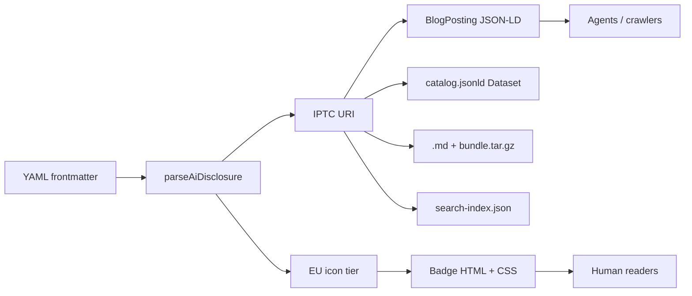
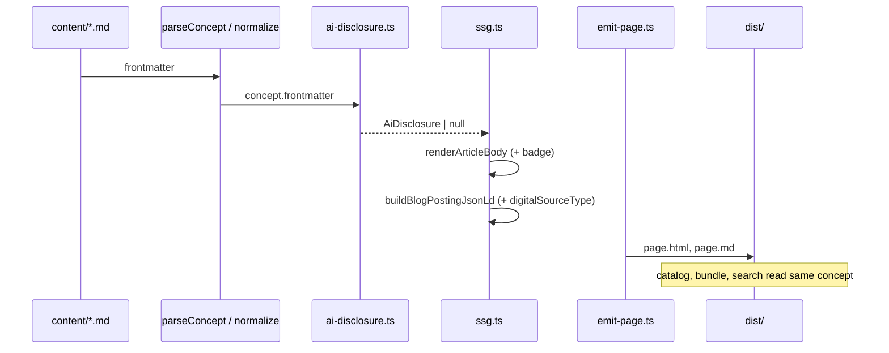
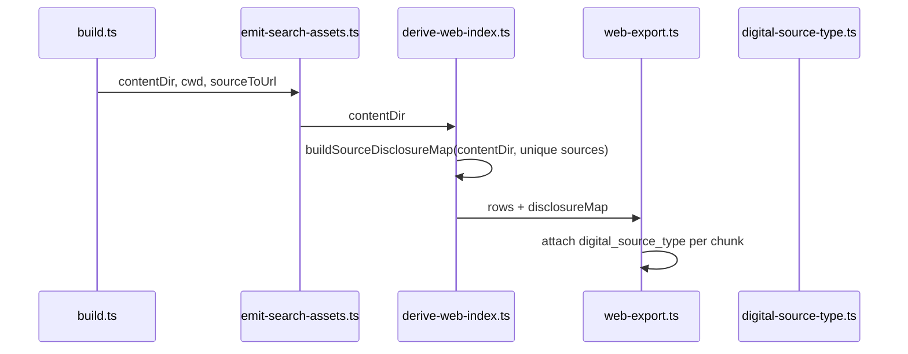

# AI Content Disclosure for sorane

| Field | Value |
|-------|-------|
| **Author** | _(TBD)_ |
| **Date** | 2026-06-20 |
| **Status** | **Implemented** (Phase 1–3.1 complete) |
| **Profile target** | `sorane-okf/0.2` (additive; `0.1` remains valid) |

### Implementation status (2026-06-21)

| Phase | Scope | Status |
|-------|-------|--------|
| **1** | Article frontmatter → badges, JSON-LD, catalog, search, Atom, OKF bundle | ✅ Shipped |
| **2** | `static/` IPTC XMP via ExifTool + `asset-provenance.yaml` | ✅ Shipped |
| **2.5** | Markdown inline image path → provenance map + `content/` raster copy | ✅ Shipped |
| **3 MVP** | `static/` JPEG/PNG C2PA embed (`build.c2pa`, `--skip-c2pa`) | ✅ Shipped |
| **3.1** | JSON-LD `associatedMedia` for provenance-tagged inline images | ✅ Shipped |

---

## Overview

sorane is an OKF-native static site generator. Today it emits HTML, per-page `.md` alternates, `catalog.jsonld`, `llms.txt`, and `okf/bundle.tar.gz`, but has **no mechanism** to declare whether content is AI-generated or AI-modified. Regulators (EU AI Act Art. 50), search engines, and agent consumers increasingly expect **standardized, machine-readable** provenance alongside **human-visible** labels.

This design adds AI disclosure end-to-end using **widely adopted standards only**:

1. **[schema.org `digitalSourceType`](https://schema.org/digitalSourceType)** on `CreativeWork` / `BlogPosting`, valued with **[IPTC Digital Source Type](https://cv.iptc.org/newscodes/digitalsourcetype/)** NewsCodes URIs.
2. **[EU AI Act transparency icons](https://digital-strategy.ec.europa.eu/en/policies/eu-icons-labelling-ai-generated-content)** (Basic, Fully AI-Generated, Partially AI-Modified) for human-facing badges—free to use, mapped from IPTC codes.
3. **IPTC Photo Metadata 2025.1** fields for raster assets in `static/` (build-time XMP via ExifTool; opt-in `build.image_metadata`).
4. **[C2PA](https://c2pa.org/)** content credentials for `static/` JPEG/PNG (opt-in `build.c2pa`; video/audio out of MVP scope).

Phase 1 ships author-controlled frontmatter → HTML badges + JSON-LD + catalog/search/OKF propagation. No proprietary `sorane:*` metadata scheme.

---

## Background & Motivation

### Current state (verified in repo, 2026-06-21)

| Area | Location | Behavior today |
|------|----------|----------------|
| OKF profile | `profile/sorane-okf-0.2.schema.json` | Disclosure fields + profile-aware AJV |
| Article HTML | `renderArticleBody()` / `renderDocsArticleBody()` | EU badges when `build.ai_disclosure` + frontmatter |
| JSON-LD | `buildBlogPostingJsonLd()` + `aiDisclosureJsonLdFields()` | `digitalSourceType`, `contributor`, `disambiguatingDescription` |
| Catalog / search / Atom | `catalog.ts`, `web-export.ts`, `blog-pages.ts` | `digital_source_type` propagation |
| Static assets | `processStaticAssets()` in `static-assets.ts` | Copy → optional IPTC XMP (`iptc-xmp-pass.ts`) → optional C2PA (`c2pa-pass.ts`) |
| Asset manifest | `content/asset-provenance.yaml` | Per-file `digitalSourceType`, `aiSystems`, `aiDisclosureNote` |
| Agent guide | `buildLlmsTxt()` | Labeled article count when disclosures present |
| E2E | `tests/e2e/*.spec.ts` | a11y, 404, OG meta, search `aria-live`, diagram smoke |

### Remaining gaps

- ~~External hotlink images (no local file) are not tagged.~~ **Shipped:** `extractExternalMarkdownImages` + `asset-provenance.yaml` keys by full URL → `associatedMedia`.
- Search UI source facet for AI disclosure — **shipped** (`search-facet--source`: ai-generated / human / disclosed).
- Video/audio C2PA out of scope.

### Motivation

- **Compliance readiness**: EU Code of Practice (June 2026) encourages C2PA for media; text pages need IPTC/schema.org alignment now.
- **Agent interoperability**: sorane already targets agents (`llms.txt`, OKF bundle); provenance must flow through the same pipes.
- **Incremental delivery**: Small PRs across `okf`, `core`, `search`, `templates` without breaking `sorane-okf/0.1` sites.

---

## Goals & Non-Goals

### Goals

| ID | Goal |
|----|------|
| G1 | Authors set disclosure in YAML frontmatter; `sorane validate` enforces `sorane-okf/0.2` |
| G2 | Article and docs pages show accessible EU-aligned badges (icon + text) when disclosure is present |
| G3 | `BlogPosting` JSON-LD includes `digitalSourceType` IPTC URI (+ optional `contributor`, `disambiguatingDescription`) |
| G4 | Provenance propagates to `.md` alternates, `okf/bundle.tar.gz`, `catalog.jsonld`, `search-index.json`, `feed.xml` |
| G5 | Site-level config toggles surfaces independently (`badges`, `json_ld`, `machine_readable`, `atom`, `show_on_lists` on featured + all list renderers) |
| G6 | Document C2PA + IPTC image pipeline extension points in `runBuild()` static pass |

### Non-Goals (phase 1)

| ID | Non-goal |
|----|----------|
| NG1 | Automatic AI detection / classification |
| NG2 | _(was phase 1)_ C2PA signing — **shipped** as opt-in phase 3 MVP |
| NG3 | _(was phase 2.5)_ Per-image inline markdown path map — **shipped** via `markdown-image-refs.ts` |
| NG4 | Video/audio C2PA |
| NG5 | Custom proprietary metadata namespaces |
| NG6 | Requiring disclosure on every page (opt-in per article) |

---

## Proposed Design

### Standards mapping



#### IPTC `digitalSourceType` codes (phase 1 supported)

Authors may use **short code** or **full URI**. `resolveDigitalSourceType()` normalizes input (see below) and resolves to a canonical `http://cv.iptc.org/...` URI.

| Short code | IPTC URI | EU badge | Typical use |
|------------|----------|----------|-------------|
| `trainedAlgorithmicMedia` | `http://cv.iptc.org/newscodes/digitalsourcetype/trainedAlgorithmicMedia` | `fully-generated` | Fully AI-generated text/media |
| `compositeWithTrainedAlgorithmicMedia` | `http://cv.iptc.org/newscodes/digitalsourcetype/compositeWithTrainedAlgorithmicMedia` | `partially-modified` | Human work substantially edited with GenAI |
| `compositeSynthetic` | `http://cv.iptc.org/newscodes/digitalsourcetype/compositeSynthetic` | `partially-modified` | Mix of synthetic + captured |
| `algorithmicMedia` | `http://cv.iptc.org/newscodes/digitalsourcetype/algorithmicMedia` | **none** (unless `euAiLabel` override) | Pure algorithmic media—not generative AI; machine-readable only |
| `humanEdits` | `http://cv.iptc.org/newscodes/digitalsourcetype/humanEdits` | **none** | Human-created/edited (explicit negative disclosure) |
| `digitalCreation` | `http://cv.iptc.org/newscodes/digitalsourcetype/digitalCreation` | **none** | Human using non-generative digital tools |

**Retired aliases** (accepted with build warning, mapped to replacement):

| Retired code | Replacement | Notes |
|--------------|-------------|-------|
| `digitalArt` | `digitalCreation` | Retired 2024-09-17 per IPTC vocabulary |

**Excluded from phase 1 allowlist** (reject under `0.2`; document rationale):

| Code | Reason |
|------|--------|
| `algorithmicallyEnhanced` | Capture/enhancement pipeline; not GenAI disclosure—defer until editorial guidance |
| `composite` | Ambiguous without `compositeSynthetic` / `compositeWithTrainedAlgorithmicMedia` granularity |
| `digitalCapture` | Camera/original capture; no AI involvement implied |

Unknown codes → validation error under `0.2`.

#### URI normalization (`resolveDigitalSourceType`)

- Accept `http://` or `https://` scheme; emit canonical **`http://`** URI in all outputs.
- Strip trailing slashes on URI input.
- Short-code input is case-sensitive (must match IPTC code exactly).
- Retired codes resolve to replacement URI; `warnings.push("digitalArt is retired; use digitalCreation")`.

#### EU icon tier inference (total mapping)

`inferEuLabel(code, override?)` rules:

1. If `euAiLabel` is set in frontmatter → use it (**requires** `digitalSourceType`; validation error if label-only).
2. Else map from IPTC code:

| IPTC code | Inferred `euAiLabel` | `showBadge` |
|-----------|----------------------|-------------|
| `trainedAlgorithmicMedia` | `fully-generated` | `true` |
| `compositeWithTrainedAlgorithmicMedia` | `partially-modified` | `true` |
| `compositeSynthetic` | `partially-modified` | `true` |
| `algorithmicMedia` | — | `false` (JSON-LD only unless `euAiLabel: basic` override) |
| `humanEdits`, `digitalCreation` | — | `false` |

3. `euAiLabel: basic` is **only** valid as an explicit author override when `digitalSourceType` is set—never inferred from `algorithmicMedia` automatically (avoids over-disclosure for non-GenAI algorithmic content).

4. When `digitalSourceType` is absent → `parseAiDisclosure()` returns `null`; no badge, no JSON-LD enrichment (opt-in).

#### Authorial guidance (editorial policy)

**Default for human-written content: omit `digitalSourceType` entirely.** Absence means “no special AI disclosure”—not “unknown.” This matches sorane’s opt-in model and avoids labeling every post.

| Situation | Recommended `digitalSourceType` | Notes |
|-----------|------------------------------|-------|
| 人が普通に書いた（IME・スペルチェック・誤字修正のみ） | **（フィールドなし）** | かな漢字変換・辞書補完は「人間が非生成ツールで書く」日常行為。`humanEdits` も `digitalCreation` も**付けない** |
| 人が書き、生成 AI に推敲・要約・翻訳などを**部分的に**依頼した | `compositeWithTrainedAlgorithmicMedia` | `aiDisclosureNote` で何をしたか書く。人が最終責任を持つ典型パターン |
| 生成 AI が本文の大部分を書き、人は軽い確認のみ | `trainedAlgorithmicMedia` | EU「完全生成」バッジ。編集責任がある場合は note で補足 |
| 人が書いたことを**明示的に**機械可読で宣言したい（ネガティブ開示） | `humanEdits`（**任意**） | バッジは出ない。JSON-LD / catalog / search にのみ載る。全記事への一括推奨は**しない** |
| 非生成のデジタルツールで「創作」したことを強調したい | `digitalCreation`（**任意**） | 画像向け語彙の延長。テキスト記事では通常不要 |

**`humanEdits` vs `digitalCreation`（テキスト）**

IPTC はもともと画像の出所語彙。テキスト記事では次の整理で十分:

- **`humanEdits`** — 「生成 AI は使っていない」と**明示したいとき**の任意ラベル（調査報道・公式声明など）
- **`digitalCreation`** — 人が非生成ツールで**新規に作った**ことを強調（イラスト・図版向け。本文ではほぼ使わない）
- **どちらも付けない** — 通常のブログ・ドキュメント（IME 含む）の既定

**かな漢字変換（IME）について**

IME の変換候補選択は「人間による編集」だが、開示対象の **Generative AI とは別カテゴリ**。EU Code of Practice や IPTC の意図（生成モデルによる合成・改変の透明性）にも該当しない。`humanEdits` を付けると「何か特別な宣言をした記事」と区別がつかなくなるため、**IME だけではフィールドを付けない**ことをドキュメント（PR8 `ai-disclosure.md`）で推奨する。

**補助ツールの目安**

| ツール | 推奨 |
|--------|------|
| IME・ローマ字入力 | フィールドなし |
| スペルチェッカー・文法チェック（非生成） | フィールドなし |
| GitHub Copilot / Claude で段落推敲 | `compositeWithTrainedAlgorithmicMedia` + `aiSystems` |
| 全文を ChatGPT に書かせてそのまま掲載 | `trainedAlgorithmicMedia` |

---

### Frontmatter & profile (`sorane-okf/0.2`)

New optional fields on `article` and `index` (index rarely needs disclosure; supported for consistency):

```yaml
---
type: article
title: Example post
profile: sorane-okf/0.2
digitalSourceType: compositeWithTrainedAlgorithmicMedia
euAiLabel: partially-modified          # optional; overrides inference
aiDisclosureNote: Draft assisted by Claude; facts verified by author.
aiSystems:
  - name: Claude
    version: "3.5"
    provider: Anthropic
---
```

#### JSON Schema additions (`profile/sorane-okf-0.2.schema.json`)

- Copy `0.1` defs; bump `$id` to `https://sorane.dev/profile/sorane-okf/0.2`.
- Add to `okfBase.properties`:

```json
"digitalSourceType": {
  "type": "string",
  "minLength": 1,
  "description": "IPTC Digital Source Type short code or full cv.iptc.org URI (schema.org digitalSourceType)"
},
"euAiLabel": {
  "type": "string",
  "enum": ["basic", "fully-generated", "partially-modified"]
},
"aiDisclosureNote": { "type": "string", "maxLength": 500 },
"aiSystems": {
  "type": "array",
  "maxItems": 10,
  "items": {
    "type": "object",
    "required": ["name"],
    "properties": {
      "name": { "type": "string", "minLength": 1 },
      "version": { "type": "string" },
      "provider": { "type": "string" }
    },
    "additionalProperties": false
  }
}
```

- **Preserve `okfBase.additionalProperties: true`** from `0.1` (do not close the base object—sorane extension keys must continue to pass schema validation).

**Cross-field validation rules (code, not schema):**

| Rule | Condition |
|------|-----------|
| R1 | If `aiSystems` is non-empty → `digitalSourceType` must be set |
| R2 | If `euAiLabel` is set → `digitalSourceType` must be set |
| R3 | If any disclosure key (`digitalSourceType`, `euAiLabel`, `aiDisclosureNote`, `aiSystems`) is present → run `resolveDigitalSourceType` / shape checks **regardless of profile** (see mixed-profile behavior below) |
| R4 | If `aiDisclosureNote` is non-empty → `digitalSourceType` must be set (same severity as R1/R2; prevents orphan note silent no-op) |

#### Validation architecture

Current code (`validate.ts` L12, L32–38) compiles a single `sorane-okf/0.1` schema. Phase 1 replaces this with profile-aware dispatch:

```typescript
const PROFILE_SCHEMA_DIR = join(REPO_ROOT, "profile");
const SUPPORTED_PROFILE_RE = /^sorane-okf\/(0\.[12])$/;

/** Called in validateSource() *before* schema dispatch. */
function validateProfileFormat(profile: string | undefined): ValidationIssue | null {
  if (profile === undefined) return null;
  if (!SUPPORTED_PROFILE_RE.test(profile)) {
    return {
      path: "frontmatter.profile",
      message:
        `Unsupported profile "${profile}"; supported: sorane-okf/0.1, sorane-okf/0.2`,
    };
  }
  return null;
}

/** Used only after profile string passes validateProfileFormat(). */
function resolveProfileSchema(profile: string): string {
  const m = profile.match(SUPPORTED_PROFILE_RE)!;
  return join(PROFILE_SCHEMA_DIR, `sorane-okf-${m[1]}.schema.json`);
}

const validatorCache = new Map<string, ReturnType<Ajv["compile"]>>();

function getValidatorForProfile(profile: string): ReturnType<Ajv["compile"]> {
  const path = resolveProfileSchema(profile);
  let v = validatorCache.get(path);
  if (!v) {
    const ajv = new Ajv({ allErrors: true, strict: false });
    addFormats(ajv);
    v = ajv.compile(JSON.parse(readFileSync(path, "utf8")));
    validatorCache.set(path, v);
  }
  return v;
}
```

- **Default profile:** `sorane-okf/0.1` when `profile` field absent (`getValidatorForProfile("sorane-okf/0.1")`).
- **Invalid profile string** (e.g. `sorane-okf/9.9`) → `validateProfileFormat()` emits a `frontmatter.profile` issue **before** `resolveProfileSchema()` / AJV dispatch; no silent fallback to `0.1`.
- **`0.2` `okfBase.additionalProperties`:** remains **`true`** (same as `0.1`). Production sorane content uses extension keys not in OKF core (`excludeFromList`, `githubUrl`, `profileUrl`, `view`, plus runtime keys `author`, `updated`, `font` read in `ssg.ts` / `docs.ts`). Closing `okfBase` would reject valid `profile: sorane-okf/0.2` sites.
- **Disclosure key validity:** enforced via PR2 cross-field rules (R1–R4) and IPTC allowlist resolution—not via `additionalProperties: false` on `okfBase`. Only `aiSystems` **item** objects use `additionalProperties: false` (per-entry shape).
- Document extension-key + disclosure-validation policy in `okf-profile.md` (PR8).
- **Mixed-profile sites:** each file validated against its own `profile` field; build does not require site-wide bump.

#### Mixed-profile / `0.1` disclosure behavior

`sorane-okf/0.1` has `additionalProperties: true`, so disclosure keys pass JSON Schema but are **not semantically validated** by schema alone. To prevent silent typos on `0.1` files:

- When **any** disclosure key is present, `validateSource()` always runs disclosure cross-field rules (R1–R4) and IPTC code resolution—**independent of profile version**.
- Under profile `0.1`, unknown IPTC codes produce a **warning** (build continues); under `0.2`, they are **errors**.
- Documentation states: full disclosure support (schema + strict validation) requires `profile: sorane-okf/0.2`; `0.1` + disclosure keys is supported at build time but discouraged for new content.

**PR split:** PR1 ships schema files + `digital-source-type.ts` + `validateProfileFormat` / `resolveProfileSchema` / cache; PR2 adds cross-field rules R1–R4 and mixed-profile warning/error policy.

---

### Core module: `packages/core/src/ai-disclosure.ts`

New pure module (unit-tested) with shared types usable from `@sorane/okf` re-export if needed.

```typescript
export const IPTC_BASE =
  "http://cv.iptc.org/newscodes/digitalsourcetype" as const;

export type EuAiLabel = "basic" | "fully-generated" | "partially-modified";

export interface AiSystemRef {
  readonly name: string;
  readonly version?: string;
  readonly provider?: string;
}

export interface AiDisclosure {
  readonly digitalSourceType: string;       // canonical URI
  readonly digitalSourceCode: string;       // short code
  readonly euLabel?: EuAiLabel;             // set when showBadge or explicit euAiLabel override
  readonly note?: string;
  readonly systems?: readonly AiSystemRef[];
  readonly showBadge: boolean;              // false for humanEdits / algorithmicMedia / digitalCreation
}

export function parseAiDisclosure(
  frontmatter: Record<string, unknown>,
): AiDisclosure | null;

export function resolveDigitalSourceType(
  raw: string,
): { uri: string; code: string } | null;

export function inferEuLabel(
  code: string,
  override?: EuAiLabel,
): EuAiLabel | undefined;  // undefined when showBadge would be false and no override

export function buildAiBadgeHtml(
  d: AiDisclosure,
  opts: {
    lang: string;
    rootPrefix: string;
    policyUrl?: string;
  },
): string;

/** Icon-only compact badge for list surfaces (featured, archive, tag/year/month). */
export function buildCompactAiBadgeHtml(
  d: AiDisclosure,
  opts: { rootPrefix: string },
): string;

export function aiDisclosureJsonLdFields(
  d: AiDisclosure,
): Record<string, unknown>;
```

#### `parseAiDisclosure` behavior

1. Read `digitalSourceType` from frontmatter (string).
2. Resolve to URI + code via `resolveDigitalSourceType()`; return `null` if absent.
3. Parse `euAiLabel`, `aiDisclosureNote`, `aiSystems` (strict shape).
4. Set `showBadge` from EU mapping table (`humanEdits`, `digitalCreation`, `algorithmicMedia` → `false` unless `euAiLabel` override). Set `euLabel` only when `showBadge: true` or `euAiLabel` was explicitly provided in frontmatter.
5. `buildAiBadgeHtml()` requires `euLabel` when `showBadge: true`; callers skip badge render when `showBadge: false` (JSON-LD / machine-readable paths use `digitalSourceType` only).

#### `aiDisclosureJsonLdFields` output

Beyond `digitalSourceType`, propagate agent-readable context on `BlogPosting`:

```typescript
export function aiDisclosureJsonLdFields(d: AiDisclosure): Record<string, unknown> {
  const fields: Record<string, unknown> = {
    digitalSourceType: d.digitalSourceType,
  };
  if (d.note) {
    fields.disambiguatingDescription = d.note;
  }
  if (d.systems?.length) {
    fields.contributor = d.systems.map((s) => ({
      "@type": "SoftwareApplication",
      name: s.name,
      ...(s.version ? { softwareVersion: s.version } : {}),
      ...(s.provider ? { author: { "@type": "Organization", name: s.provider } } : {}),
    }));
  }
  return fields;
}
```

- `disambiguatingDescription` carries `aiDisclosureNote` without overwriting page `description`.
- `contributor` with `SoftwareApplication` maps `aiSystems` for schema.org consumers (catalog still adds `ai-system:*` keywords for DCAT facet filtering).

#### Badge HTML (accessible)

Inserted in `renderArticleBody()` after `tagsHtml()`, before `</header>`:

```html
<aside class="ai-disclosure ai-disclosure--partially-modified" role="note"
       aria-label="AI content disclosure">
  
  <div class="ai-disclosure-text">
    <p class="ai-disclosure-title">Partially AI-modified content</p>
    <p class="ai-disclosure-detail">Draft assisted by Claude; facts verified by author.</p>
    <p class="ai-disclosure-meta">
      <a href="http://cv.iptc.org/.../compositeWithTrainedAlgorithmicMedia"
         rel="external noopener">IPTC: compositeWithTrainedAlgorithmicMedia</a>
    </p>
  </div>
</aside>
```

- Labels from `siteLabels()` extension (`aiDisclosureTitle`, etc.)—JA + EN like `packages/core/src/site-labels.ts`.
- EU SVGs vendored under `templates/default/assets/ai-labels/` (official EU assets, localized alt via text).
- `site.build.ai_disclosure.policy_url` adds “Learn more” link.

---

### Build pipeline integration



#### `packages/core/src/ssg.ts`

| Function | Change |
|----------|--------|
| `buildBlogPostingJsonLd()` | Accept optional `aiDisclosure?: AiDisclosure`; merge `aiDisclosureJsonLdFields()` |
| `renderArticleBody()` | Call `buildAiBadgeHtml()` when disclosure present and `ai_disclosure.badges` enabled |
| `renderDocsArticleBody()` (`docs.ts`) | Same badge hook after `<h1>` (docs-mode pages use `renderDocsArticleFromConcept()`, not `renderArticleBody()`) |
| `ArticleListEntry` | Add optional `aiDisclosure?: AiDisclosure` |
| `renderBlogIndexBody()` | Compact badge via `buildCompactAiBadgeHtml()` when `show_on_lists`: **featured** block (`latestArticle`) **and** archive list meta |
| `renderArchiveListBody()` (`blog-pages.ts`) | Same compact badge in list meta for archive pagination, year/month, and tag list pages |

#### `packages/core/src/build.ts`

```typescript
// Per article (~L416-430)
const aiDisclosure = parseAiDisclosure(p.concept.frontmatter);
const jsonLd = buildBlogPostingJsonLd({
  // ...existing fields
  aiDisclosure: aiDisclosure ?? undefined,
});

// articleSummaries (~L258-274)
return {
  // ...
  aiDisclosure: parseAiDisclosure(p.concept.frontmatter) ?? undefined,
};
```

Pass `resolveAiDisclosureFlags(config.build.ai_disclosure, …)` into render functions; gate JSON-LD in `build.ts` (~L419) on `json_ld`, catalog on `machine_readable`.

#### `packages/core/src/emit-page.ts`

No structural change; disclosure lives in `concept.frontmatter` and is already serialized to `.md` via `conceptToOkfMarkdown()`.

**OKF serialization (critical):** disclosure fields live in `concept.frontmatter` (OQ1 resolved: **not** promoted to first-class `OkfConcept` properties in phase 1). `KEY_ORDER` alone is insufficient—`toOkfFrontmatterLines()` explicitly excludes `KEY_ORDER` keys from the `restKeys` loop (L63–68) and only emits fields written in L55–61.

Phase 1 changes to `packages/okf/src/serialize.ts`:

1. Extend `KEY_ORDER` after `profile`:

```typescript
const KEY_ORDER = [
  "type", "title", "timestamp", "description", "resource", "tags", "profile",
  "digitalSourceType", "euAiLabel", "aiDisclosureNote", "aiSystems",
] as const;
```

2. **Explicit emission** in `toOkfFrontmatterLines()` (mirroring `profile`):

```typescript
const fm = concept.frontmatter;
if (fm.digitalSourceType) lines.push(`digitalSourceType: ${formatScalar(fm.digitalSourceType)}`);
if (fm.euAiLabel) lines.push(`euAiLabel: ${formatScalar(fm.euAiLabel)}`);
if (fm.aiDisclosureNote) lines.push(`aiDisclosureNote: ${formatScalar(fm.aiDisclosureNote)}`);
if (Array.isArray(fm.aiSystems) && fm.aiSystems.length > 0) {
  appendAiSystemsEntry(lines, "aiSystems", fm.aiSystems);
}
```

3. **`appendAiSystemsEntry()`** for array-of-objects (current `appendYamlEntry` L36–37 stringifies objects to `"[object Object]"`):

```typescript
function appendAiSystemsEntry(
  lines: string[],
  key: string,
  systems: readonly { name: string; version?: string; provider?: string }[],
): void {
  lines.push(`${key}:`);
  for (const s of systems) {
    lines.push(`  - name: ${formatScalar(s.name)}`);
    if (s.version) lines.push(`    version: ${formatScalar(s.version)}`);
    if (s.provider) lines.push(`    provider: ${formatScalar(s.provider)}`);
  }
}
```

4. **Round-trip tests** in PR6: `conceptToOkfMarkdown()` → re-parse preserves all four disclosure fields including multi-entry `aiSystems`.

---

### `catalog.jsonld`

`buildCatalogJsonLd()` in `packages/core/src/catalog.ts`:

```typescript
const dataset: Record<string, unknown> = { /* existing */ };
const disclosure = parseAiDisclosure(e.concept.frontmatter);
if (disclosure) {
  dataset.digitalSourceType = disclosure.digitalSourceType;
  if (disclosure.systems?.length) {
    dataset.keywords = [
      ...(dataset.keywords as string[]),
      ...disclosure.systems.map((s) => `ai-system:${s.name}`),
    ];
  }
}
```

`Dataset` is a `CreativeWork` subtype in schema.org—`digitalSourceType` is valid.

---

### Search index (`packages/search`)

#### Content-dir plumbing (export-time enrichment)

Phase 1 avoids SQLite `IndexStore` migration. Enrichment happens at web-export by re-reading source frontmatter. This requires threading `contentDir` through the export chain (currently missing):



**`buildSourceDisclosureMap(contentDir, sources)`** (`packages/search/src/disclosure-map.ts`):

- Dedupe `ChunkRow.source` paths.
- For each source, read `join(contentDir, source)` frontmatter once.
- Resolve via `@sorane/okf` `resolveDigitalSourceType()`; store canonical URI or omit.
- Missing source file (CI dist-only builds) → omit field silently.

**API extensions:**

```typescript
// derive-web-index.ts
export async function deriveWebIndex(
  dbPath: string,
  outPath: string,
  sourceToUrl: (source: string) => string,
  mode: WebSearchMode,
  contentDir?: string,  // NEW
): Promise<DeriveResult>;

// emit-search-assets.ts — add to EmitSearchAssetsOptions
readonly contentDir: string;

// build.ts — emitSearchAssets call (~L763)
await emitSearchAssets({
  // ...existing
  contentDir: join(cwd, config.build.content_dir),
});
```

#### Web export schema bump (FTS **and** hybrid)

| Constant | Old | New |
|----------|-----|-----|
| `FTS_WEB_INDEX_SCHEMA_VERSION` | 3 | **4** |
| `WEB_INDEX_SCHEMA_VERSION` | 2 | **3** |

Add to `WebChunk` / `FtsWebChunk`:

```typescript
readonly digital_source_type?: string; // IPTC URI; omitted when unset
```

**Both** `buildFtsWebIndex()` and `buildWebIndex()` must attach `digital_source_type` from the disclosure map keyed by `row.source` **only when** `machine_readable` is resolved `true` for the build. When `machine_readable: false`, omit the field entirely (not `null`) so export shape matches pre-change schema.

**Flag plumbing:** thread resolved `machineReadable: boolean` from `resolveAiDisclosureFlags()` through `build.ts` → `emitSearchAssets` → `deriveWebIndex` → `buildFtsWebIndex` / `buildWebIndex`. When gated off, pass an empty disclosure map or skip attachment per chunk.

```typescript
// emit-search-assets.ts — add to EmitSearchAssetsOptions
readonly machineReadable?: boolean;  // default true when any labeled content exists
```

Hybrid + flag-off test cases required in `tests/web-export.test.ts`.

Search UI includes a **source facet** (`search-facet--source`) filtering on chunk `digital_source_type` (`ai-generated` / `human` / `disclosed`).

---

### `llms.txt`, Atom feed & `site-meta.ts`

#### `llms.txt`

Extend `buildLlmsTxt()` opts:

```typescript
export interface LlmsTxtOptions {
  // ...existing
  readonly aiLabeledCount?: number;
}
```

`runBuild()` passes `aiLabeledCount` from the article loop aggregate (same counter as observability log).

```markdown
## AI content disclosure

Articles may declare `digitalSourceType` (IPTC NewsCodes / schema.org) in OKF frontmatter.
Published HTML includes JSON-LD `digitalSourceType` and optional EU transparency badges.
Search index (`assets/search-index.json`) exposes `digital_source_type` per chunk when set.
Atom feed (`feed.xml`) includes `category term` when disclosure is present (see below).

Labeled articles: 3
```

#### Atom feed (phase 1 — included)

`buildAtomFeed()` gains optional disclosure per entry. `FeedEntry` extends:

```typescript
export interface FeedEntry {
  // ...existing
  readonly digitalSourceCode?: string; // short IPTC code
}
```

When set, emit inside `<entry>`:

```xml
<category term="ai-disclosure:compositeWithTrainedAlgorithmicMedia"
          scheme="http://cv.iptc.org/newscodes/digitalsourcetype" />
```

`build.ts` feed assembly (~L698–707) passes `digitalSourceCode` from `articleSummaries[].aiDisclosure`. Respects `ai_disclosure.atom` flag (default `true` when disclosure present).

---

### Site configuration

`packages/core/src/config.ts` — extend types and `mergeConfig()` with **deep merge** for nested `ai_disclosure` (current `mergeConfig` shallow-merges `build` only):

```typescript
export interface AiDisclosureConfig {
  /** Master switch; default true (see flag resolution below) */
  readonly enabled?: boolean;
  /** Human-visible EU badges on article/docs pages; default follows enabled */
  readonly badges?: boolean;
  /** BlogPosting JSON-LD digitalSourceType + contributor; default true when disclosure present */
  readonly json_ld?: boolean;
  /** catalog.jsonld, search-index, Atom category, llms.txt; default true when disclosure present */
  readonly machine_readable?: boolean;
  /** Atom feed category term; default true when disclosure present */
  readonly atom?: boolean;
  /** Compact badge on featured block + index/archive/tag/year/month lists; default false */
  readonly show_on_lists?: boolean;
  /** Link from badge to site AI policy page */
  readonly policy_url?: string;
}

export interface SoraneBuildConfig {
  // ...existing fields
  readonly ai_disclosure?: AiDisclosureConfig;
}
```

**`mergeConfig` change:**

```typescript
build: {
  ...DEFAULT_CONFIG.build,
  ...partial.build,
  blog: { ...DEFAULT_CONFIG.build.blog, ...partial.build?.blog },
  ai_disclosure: partial.build?.ai_disclosure
    ? { ...DEFAULT_CONFIG.build.ai_disclosure, ...partial.build.ai_disclosure }
    : DEFAULT_CONFIG.build.ai_disclosure,
},
```

Add `DEFAULT_CONFIG.build.ai_disclosure = {}` (all sub-flags undefined → resolved at build time).

#### Flag resolution algorithm (`resolveAiDisclosureFlags(config, hasAnyDisclosure)`)

| Input | Resolved value |
|-------|----------------|
| `enabled` undefined | `true` |
| `enabled` explicit `false` | human badge surfaces off (`badges`; `show_on_lists` follows `badges` unless explicitly set); `json_ld`, `machine_readable`, `atom` unchanged |
| `badges` undefined | `enabled` (default `true`) |
| `json_ld` undefined | `true` when disclosure present on page |
| `machine_readable` undefined | `true` when disclosure present on page |
| `atom` undefined | `machine_readable` |
| `show_on_lists` undefined | `false` |

`enabled: false` is the master switch for **human-visible badge surfaces only** (`badges`, and `show_on_lists` unless explicitly overridden); `json_ld`, `machine_readable`, and `atom` remain independently controlled (default per-page when disclosure present). Sites that want zero provenance output set all flags `false`. Validation runs whenever disclosure keys are present regardless of flags.

#### Surface × flag matrix

| Surface | Controlling flag |
|---------|------------------|
| EU badge HTML (article + docs) | `badges` |
| Compact badge on featured + list pages | `show_on_lists` (also follows `enabled` / `badges` unless explicitly set) |
| `BlogPosting` JSON-LD | `json_ld` |
| `catalog.jsonld` | `machine_readable` |
| `search-index.json` | `machine_readable` |
| Atom `category` | `atom` (falls back to `machine_readable`) |
| `llms.txt` disclosure section | `machine_readable` |
| `.md` alternates / OKF bundle | always (author frontmatter; not gated) |

Example `sorane.yaml`:

```yaml
build:
  ai_disclosure:
    badges: true
    json_ld: true
    show_on_lists: false
    policy_url: /ai-policy.html
```

`tests/config.test.ts`: deep-merge and flag-resolution cases, including:
- `enabled: false` + page with disclosure + `json_ld` undefined → JSON-LD still emitted
- `enabled: false` + `show_on_lists: true` → compact list badges still render (explicit override)

---

### CSS & assets

`templates/default/assets/main.css`:

```css
.ai-disclosure {
  display: flex;
  gap: 0.75rem;
  align-items: flex-start;
  margin: 1rem 0 0;
  padding: 0.75rem 1rem;
  border: 1px solid var(--border);
  border-radius: 4px;
  font-size: 0.9rem;
}
.ai-disclosure-icon { flex-shrink: 0; }
.ai-disclosure-title { font-weight: var(--weight-emphasis); margin: 0; }
.ai-disclosure-detail, .ai-disclosure-meta { color: var(--muted); margin: 0.25rem 0 0; }
```

New directory: `templates/default/assets/ai-labels/{basic,fully-generated,partially-modified}.svg`

`runBuild()` today copies only `main.css` via `resolveThemeCss()` + `copyFileSync` (L750–755). **PR4 adds theme asset directory copy:**

```typescript
// packages/core/src/theme-assets.ts
export function resolveThemeAssetDir(cwd: string, subdir: string): string | null;

// build.ts — after main.css copy
const aiLabelsSrc = resolveThemeAssetDir(cwd, "ai-labels");
if (aiLabelsSrc) {
  cpSync(aiLabelsSrc, join(outDir, "assets/ai-labels"), { recursive: true });
}
```

`resolveThemeAssetDir` mirrors `resolveThemeCss()` monorepo-aware path resolution. PR4 acceptance: built article HTML `src` resolves to existing `dist/assets/ai-labels/*.svg`.

---

### Static image pipeline (phase 2–3 hooks)

Implemented in `packages/core/src/static-assets.ts` (replaces raw `cpSync` in `runBuild()`):

1. `cpSync(static/)` → `dist/static/`
2. If `build.image_metadata.enabled`: ExifTool embeds IPTC XMP per `asset-provenance.yaml` entry
3. If `build.c2pa.enabled` (and not `--skip-c2pa`): c2patool signs JPEG/PNG

**Out of scope (all phases unless noted):** inline markdown images under `content/`, favicons, font binaries, external hotlinks, `website/static/` paths outside `build.static_dir`.

#### Phase 2 — IPTC Photo Metadata (`static/` only)

Introduce `packages/core/src/static-assets.ts`:

```typescript
export interface StaticAssetPassOptions {
  readonly staticSrc: string;
  readonly outDir: string;
  readonly imageMetadata?: ImageMetadataPassConfig;
}

export async function processStaticAssets(opts: StaticAssetPassOptions): Promise<void>;
```

- Gate behind `build.image_metadata.enabled` and optional `exiftool` on PATH (13.40+).
- For each `*.{jpg,jpeg,png,webp}` in `build.static_dir` (default `static/`):
  - Lookup provenance in `content/asset-provenance.yaml` (PR10 ships this manifest schema).
  - Write XMP: `AI System Used`, `AI Prompt Information` (optional), `Digital Source Type`.
- **No-op default**; copy-only behavior preserved.

**Phase 2.5 (shipped):** `markdown-image-refs.ts` scans `` in all content; resolves to `static/` or `content/` rasters; `lookupAssetProvenance` accepts markdown/public/content aliases; `content/` images copy into matching `dist/` paths before XMP/C2PA.

#### Phase 3 — C2PA MVP (narrow scope)

```typescript
export interface C2paPassConfig {
  readonly enabled: boolean;
  readonly certificatePath?: string;  // env: SORANE_C2PA_CERT / SORANE_C2PA_KEY
  readonly embed?: boolean;           // default true; false = sidecar .c2pa (dev only)
}
```

**Phase 3 MVP** (PR11): opt-in signing of `static/**/*.{jpg,jpeg,png}` only.

| Topic | Decision |
|-------|----------|
| Embed vs sidecar | **Embed** in output JPEG/PNG for production; sidecar breaks CDN cache keys—dev-only flag |
| Reproducible builds | Signing is inherently non-reproducible; document `--skip-c2pa` for deterministic CI snapshots |
| Cert provisioning | Manual setup doc: local dev key + GitHub Actions / Cloudflare Pages secrets; no hosted CA |
| Cloudflare Pages | Note Pages 25 MiB asset limit—`c2patool` binary may require pre-install in build image, not bundled in dist |
| JSON-LD linkage | **Phase 3.1 shipped** — `associated-media.ts` emits `associatedMedia` `ImageObject` entries for inline images with provenance when `json_ld` enabled |

```mermaid
flowchart TB
  IMG[static/**/*.{jpg,png}] --> SCAN[processStaticAssets]
  SCAN --> IPTC[IPTC XMP embed Phase 2]
  IPTC --> C2PA[c2patool sign embed]
  C2PA --> OUT[dist/static/ signed blobs]
```

| Content type | Phase 1 | Phase 2 | Phase 3 |
|--------------|---------|---------|---------|
| Markdown/HTML articles | JSON-LD + EU badge | — | — |
| Raster in `static/` | Copied verbatim | XMP metadata | C2PA embed |
| Markdown inline images | — | XMP + copy (`content/`) | C2PA when raster + creds |
| External hotlinks | — | — | Out of scope |

**Credential storage:** CI secret / local dev key—not committed. `sorane build` warns if `c2pa.enabled` without cert path or env.

---

### Migration

`packages/core/src/migrate.ts`:

- When migrating, preserve all disclosure keys (`digitalSourceType`, `euAiLabel`, `aiDisclosureNote`, `aiSystems`) via existing `normalizeConcept` / `frontmatter` passthrough—no field stripping.
- Optional CLI flag `sorane migrate --bump-profile 0.2` sets `profile: sorane-okf/0.2` without inventing disclosure fields.

`packages/cli/src/migrate.ts`: parse `--bump-profile <version>`; when `0.2`, write bumped profile into migrated output.

`packages/cli/src/validate.ts`: no change beyond okf validator picking schema by profile (invalid profile errors via `validateProfileFormat()` in PR2).

---

## API / Interface Changes

### `buildBlogPostingJsonLd` (before / after)

**Before** (`packages/core/src/ssg.ts`):

```typescript
export function buildBlogPostingJsonLd(opts: {
  title: string;
  description?: string;
  url: string;
  datePublished?: string;
  dateModified?: string;
  author?: string;
  siteTitle: string;
  lang: string;
}): string
```

**After:**

```typescript
export function buildBlogPostingJsonLd(opts: {
  // ...existing
  aiDisclosure?: AiDisclosure;
}): string {
  const data: Record<string, unknown> = { /* ... */ };
  if (opts.aiDisclosure) {
    Object.assign(data, aiDisclosureJsonLdFields(opts.aiDisclosure));
  }
  // ...
}
```

**JSON-LD output example:**

```json
{
  "@context": "https://schema.org",
  "@type": "BlogPosting",
  "headline": "Example",
  "digitalSourceType": "http://cv.iptc.org/newscodes/digitalsourcetype/compositeWithTrainedAlgorithmicMedia",
  "disambiguatingDescription": "Draft assisted by Claude; facts verified by author.",
  "contributor": [
    {
      "@type": "SoftwareApplication",
      "name": "Claude",
      "softwareVersion": "3.5",
      "author": { "@type": "Organization", "name": "Anthropic" }
    }
  ]
}
```

### `ArticleListEntry`

```typescript
export interface ArticleListEntry {
  // ...existing
  readonly aiDisclosure?: AiDisclosure;
}
```

### Search index chunk (schema v4)

```json
{
  "source": "article/2025-06-20-welcome.md",
  "url": "2025-06-20-welcome.html",
  "title": "Welcome",
  "digital_source_type": "http://cv.iptc.org/newscodes/digitalsourcetype/trainedAlgorithmicMedia",
  "snippet": "..."
}
```

---

## Data Model Changes

| Layer | Change | Migration |
|-------|--------|-----------|
| Frontmatter | Optional `digitalSourceType`, `euAiLabel`, `aiDisclosureNote`, `aiSystems` | None required |
| Profile | New `sorane-okf/0.2.schema.json` | Opt-in per site |
| `OkfConcept` | Fields remain in `frontmatter`; optional typed accessor via `parseAiDisclosure()` | N/A |
| SQLite search index | New column on chunk rows **or** denormalized at export only (phase 1: export-only from frontmatter re-read to avoid DB migration) | Re-run `sorane index` optional |
| dist layout | `assets/ai-labels/*.svg` | Auto on build |

**Phase 1 search strategy:** avoid `IndexStore` schema migration; inject `digital_source_type` in **both** `buildFtsWebIndex()` and `buildWebIndex()` via `buildSourceDisclosureMap(contentDir, sources)` at export time. Requires `contentDir` threaded from `build.ts` → `emitSearchAssets` → `deriveWebIndex`.

---

## Alternatives Considered

### 1. Custom `sorane:aiGenerated` meta tag

| Pros | Cons |
|------|------|
| Simple boolean | Proprietary; poor agent interoperability |
| Easy to parse | Conflicts with user requirement |

**Rejected.** Use schema.org + IPTC only.

### 2. C2PA for all content including HTML

| Pros | Cons |
|------|------|
| Tamper-evident | Impractical for generated HTML text in SSG |
| Industry momentum | Requires signing infra per deploy |

**Deferred** to media phase; plan hooks only.

### 3. Microdata in body instead of JSON-LD

| Pros | Cons |
|------|------|
| Visible in markup | Duplicates JSON-LD; harder for existing `extraHead` pattern |

**Rejected.** Extend existing `buildBlogPostingJsonLd()` injection via `emitPage` `extraHead`.

### 4. Single boolean `aiGenerated: true`

| Pros | Cons |
|------|------|
| Author-friendly | Cannot express partial modification; not EU/IPTc aligned |

**Rejected.** Use IPTC vocabulary for granularity.

---

## Security & Privacy Considerations

| Threat | Severity | Mitigation |
|--------|----------|------------|
| Authors falsely label human content as AI | Low | Disclosure is declarative; org policy / editorial review |
| Authors omit AI use | Medium | Docs + EU legal obligation outside sorane scope; optional CI lint for `digitalSourceType` on paths matching `content/article/*` |
| `aiSystems` leaks internal tooling | Medium | Max 10 systems; no automatic collection; docs warn against secrets in `aiDisclosureNote` |
| XSS via `aiDisclosureNote` | High | `escapeHtml()` on all badge text (same as `article-meta`) |
| C2PA private key exposure (future) | High | Keys via env/CI secrets only; never in repo |
| EU icon misuse | Medium | Map only from declared IPTC codes; document permitted use per EU guidance |

**Privacy:** `aiSystems` may name vendor products; authors should not put PII or prompts with personal data in `aiDisclosureNote` (document in website guide).

---

## Observability

| Signal | Implementation |
|--------|----------------|
| Build log | `[sorane] ai-disclosure: N articles labeled / M total` at end of `runBuild()` |
| Validation | `sorane validate` reports unknown `digitalSourceType` codes under profile `0.2` |
| Warning | `aiSystems` without `digitalSourceType` → validation error |
| Metrics (future) | Optional `--json` build summary field `ai_labeled_pages` |

No PII in logs.

---

## Rollout Plan

1. **Land PRs 1–7** behind no runtime flag (disclosure purely opt-in via frontmatter).
2. **Profile default stays `0.1`** until site owners bump.
3. **website/** docs + `template/site/` example article with disclosure.
4. **sorane.dev** publishes `sorane-okf-0.2.schema.json` to `website/static/profile/` (mirror `0.1` pattern).
5. **Rollback:** remove frontmatter fields; rebuild—no persistent state.

`build.ai_disclosure.enabled: false` disables human badges only; `json_ld` / `machine_readable` default independently (see flag matrix). Validation runs whenever disclosure keys are present regardless of flags.

---

## Open Questions

| # | Question | Owner |
|---|----------|-------|
| OQ1 | Promote `digitalSourceType` to first-class `OkfConcept` field vs keep in `frontmatter` only? | **Resolved:** keep in `frontmatter`; explicit `toOkfFrontmatterLines()` emission |
| OQ2 | Per-image disclosure syntax: YAML sidecar vs markdown attribute extension? | Phase 2: `content/asset-provenance.yaml`; phase 2.5: markdown path map |
| OQ3 | Should `humanEdits` be encouraged on all legacy posts (negative disclosure)? | **Resolved:** supported but **optional**; default human posts omit `digitalSourceType` (IME included). `humanEdits` only when author wants explicit negative disclosure |
| OQ4 | Atom feed: add `category term` for AI disclosure? | **Resolved:** yes, phase 1 via `buildAtomFeed` |
| OQ5 | C2PA: embed vs sidecar manifest for JPEG in `static/`? | **Resolved:** embed for production; sidecar dev-only |
| OQ6 | Re-export IPTC resolver from `@sorane/okf` to keep search free of `@sorane/core` cycle? | **Yes** — `packages/okf/src/digital-source-type.ts` |

---

## References

- [schema.org/digitalSourceType](https://schema.org/digitalSourceType)
- [IPTC Digital Source Type vocabulary](https://cv.iptc.org/newscodes/digitalsourcetype/)
- [EU AI Act transparency icons](https://digital-strategy.ec.europa.eu/en/policies/eu-icons-labelling-ai-generated-content)
- [IPTC Photo Metadata 2025.1 guidance](https://iptc.org/std/photometadata/documentation/)
- [C2PA specification](https://c2pa.org/specifications/specifications/2.2/index.html)
- sorane: `profile/sorane-okf-0.1.schema.json`, `packages/core/src/build.ts`, `packages/core/src/ssg.ts`, `packages/core/src/catalog.ts`

---

## Key Decisions

1. **Primary machine-readable field:** schema.org `digitalSourceType` with IPTC NewsCodes URIs—not a sorane-specific schema.
2. **Human labels:** EU AI Act transparency icons (SVG), mapped only from GenAI-relevant IPTC codes; `digitalCreation` / `humanEdits` / `algorithmicMedia` → no badge unless explicit `euAiLabel` override.
3. **Profile version:** additive `sorane-okf/0.2`; disclosure cross-field checks run on `0.1` when keys present (warn on bad codes).
4. **Frontmatter shape:** top-level `digitalSourceType` plus optional `euAiLabel`, `aiDisclosureNote`, `aiSystems`; stays in `frontmatter` with explicit serialize emission.
5. **Propagation surfaces:** HTML badge (article + docs), `BlogPosting` JSON-LD (+ `contributor`, `disambiguatingDescription`), `catalog.jsonld`, `.md` alternates, OKF bundle, `search-index.json`, `feed.xml`, `llms.txt`.
6. **Search index:** `digital_source_type` at web-export (schema v4 FTS / v3 hybrid); `contentDir` threaded through `emitSearchAssets` → `deriveWebIndex`.
7. **Config flags:** separate `badges`, `json_ld`, `machine_readable`, `atom`—`enabled: false` does not suppress JSON-LD.
8. **C2PA:** phase 3 MVP shipped — opt-in `static/` JPEG/PNG embed; phase 3.1 `associatedMedia` JSON-LD shipped.
9. **No auto-detection:** disclosure is author-declared only.
10. **i18n:** badge strings via extended `siteLabels()` (JA default + EN).
11. **IPTC resolver:** `packages/okf/src/digital-source-type.ts`; normalize `https` → `http`; retired `digitalArt` → `digitalCreation` with warning.
12. **Human default:** omit `digitalSourceType` for ordinary human writing (IME, spell-check). `humanEdits` optional for explicit “no GenAI” machine-readable assertion—not site-wide mandatory.

---

## PR Plan (ordered, incremental PRs with title, files, dependencies, acceptance criteria)

| # | Title | Files (primary) | Deps | Description / acceptance |
|---|-------|-----------------|------|--------------------------|
| **PR1** | `feat(okf): digital-source-type resolver, 0.2 schema, profile-aware validation` | `packages/okf/src/digital-source-type.ts`, … | — | IPTC allowlist; profile-dispatched AJV. | ✅ |
| **PR2** | `feat(okf): cross-field disclosure validation` | `packages/okf/src/validate.ts`, … | PR1 | R1–R4 cross-field rules; mixed-profile warn/error. | ✅ |
| **PR3** | `feat(core): parse AiDisclosure and extend JSON-LD` | `packages/core/src/ai-disclosure.ts`, … | PR1 | `parseAiDisclosure`, `aiDisclosureJsonLdFields`. | ✅ |
| **PR4** | `feat(templates): EU badges, CSS, theme asset copy` | `templates/default/assets/ai-labels/*.svg`, … | PR3 | Badge HTML + theme asset copy. | ✅ |
| **PR5** | `feat(core): wire badges, docs mode, config flags, Atom feed` | `packages/core/src/ssg.ts`, … | PR4 | Badges, flags, Atom category, list compact badges. | ✅ |
| **PR6** | `feat(okf): serialize disclosure fields + catalog propagation` | `packages/okf/src/serialize.ts`, … | PR3 | Round-trip + catalog `digitalSourceType`. | ✅ |
| **PR7** | `feat(search): digital_source_type in FTS + hybrid export` | `packages/search/src/web-export.ts`, … | PR1, PR5 | FTS v4 / hybrid v3 export field. | ✅ |
| **PR8** | `docs: AI disclosure guide, migrate flag, template example` | `website/content/ai-disclosure.md`, … | PR5–7 | Author guide + `--bump-profile 0.2`. | ✅ |
| **PR9** | `feat(core): static asset pipeline hook (stub)` | `packages/core/src/static-assets.ts`, `packages/core/src/build.ts`, `packages/core/src/config.ts` | PR5 | Refactor `cpSync` into `processStaticAssets`; no-op default. **Accept:** default build identical to today. | ✅ |
| **PR10** | `feat(core): IPTC XMP for static/ images` | `packages/core/src/iptc-xmp-pass.ts`, `static-assets.ts`, `asset-provenance.yaml` | PR9 | Opt-in XMP via ExifTool; manifest schema; inline-image gap documented (2.5). **Accept:** YAML entry → XMP on `static/` image. | ✅ |
| **PR11** | `feat(core): C2PA signing MVP for static/ raster` | `packages/core/src/c2pa-pass.ts`, `static-assets.ts`, CI | PR10 | Opt-in embed signing; PEM env vars. **Accept:** signed raster in dist when enabled + cert present. | ✅ |
| **PR12** | `feat(core): markdown image provenance map (2.5)` | `markdown-image-refs.ts`, `asset-provenance.ts`, `static-assets.ts`, `build.ts` | PR10 | Inline `` → manifest aliases; `content/` raster copy. **Accept:** YAML key `../static/x.png` tags referenced asset. | ✅ |
| **PR13** | `feat(core): associatedMedia JSON-LD (3.1)` | `associated-media.ts`, `ssg.ts`, `build.ts` | PR12 | `BlogPosting.associatedMedia` for provenance-tagged inline images. **Accept:** JSON-LD includes `ImageObject` with `digitalSourceType`. | ✅ |

---

*End of design document.*