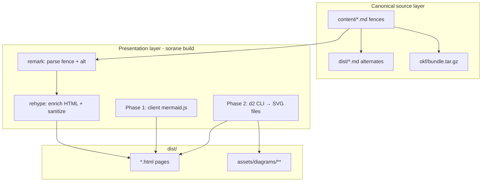
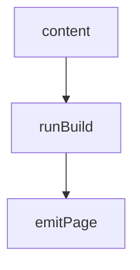
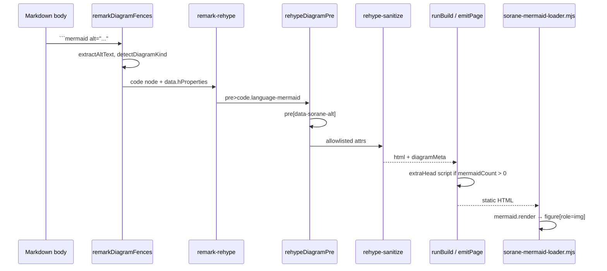

# Diagram formats for sorane (Mermaid, D2, etc.)

| Field | Value |
|-------|-------|
| **Author** | _(TBD)_ |
| **Date** | 2026-06-20 |
| **Status** | Draft |
| **Profile target** | None (body syntax only; `sorane-okf/0.1` and `0.2` unchanged) |

---

## Overview

sorane is an OKF-native static site generator. It deploys to Cloudflare Pages via GitHub Actions (`.github/workflows/pages.yml`: Node 23, `npm ci` → index → build → deploy). Today **diagram fences render as inert code blocks** — `packages/core/src/render.ts` uses `remark-gfm` only, so ` ```mermaid ` fences become plain `<pre><code class="language-mermaid">` with no SVG output and no client enhancement.

This design adds **pluggable diagram rendering** informed by bunsen’s Strategy A (text source is canonical; render is presentation) and three-tier model (① pure text, ② lightweight client JS, ③ heavy build-time artifacts). Phase 1 ships **Mermaid client-side rendering** (bunsen 013 pattern, zero Chromium). Phase 2 adds **D2 build-time SVG** via CLI. Later phases may add Mermaid SSR (`mmdc`), Graphviz, or PlantUML/Kroki — all optional and CI-scoped.

**OKF principle preserved:** sibling `.md` alternates (`emitPage()` → `conceptToOkfMarkdown()`) keep raw fence source unchanged; HTML is a derived view.

---

## Background & Motivation

### Current state (verified in repo)

| Area | Location | Behavior today |
|------|----------|----------------|
| Markdown → HTML | `packages/core/src/render.ts` | `remark-parse` → `remark-gfm` → `remark-rehype` → `rehype-sanitize` → string |
| Mermaid fences | `renderMarkdown()` / `renderMarkdownDocument()` | `<pre><code class="language-mermaid">…</code></pre>` only |
| Page shell | `packages/core/src/ssg.ts` `buildPage()` | `extraHead?: string[]` appended in `<head>` after CSS/JSON-LD links |
| Page emit | `packages/core/src/emit-page.ts` | Merges `extraHead` (JSON-LD, font CSS, search scripts) into `buildPage()` |
| Build orchestration | `packages/core/src/build.ts` `runBuild()` | Per-page `extraHead`; copies theme assets via `resolveThemeAssetDir()` (ai-labels pattern) |
| Theme assets | `packages/core/src/theme-assets.ts` | Monorepo-aware `templates/default/assets/{subdir}/` resolution |
| `.md` alternates | `emit-page.ts` L43 | `conceptToOkfMarkdown()` — fences preserved verbatim in body |
| OKF bundle | `packages/okf/src/bundle.ts` | Same markdown serialization |
| Search chunks | `packages/search/src/chunker.ts` | `code` blocks → `""` in `blockToText()` (diagram source not indexed) |
| CI deploy | `.github/workflows/pages.yml` | `ubuntu-latest`, Node 23, no Chromium, no extra binaries |
| CI test | `.github/workflows/test.yml` | `npm ci` → typecheck → coverage tests only |
| Design docs on site | `design/ai-content-disclosure.md` | Contains Mermaid examples that **do not render** on sorane.dev |

### bunsen prior art (reference: `/Users/masanork/repo/bunsen`)

| Topic | bunsen location | sorane takeaway |
|-------|-----------------|-----------------|
| Strategy A | `docs/architecture.md` §9 | Fence `info string` selects backend; source stays in markdown |
| Three tiers | `docs/architecture.md` §9 | Mermaid = tier ② client; D2 = tier ③ build-time SVG |
| Mermaid evolution | 008 SSR → 012 SSR retired (Workers/Chromium) → **013 client `mermaid.js`** | Adopt 013 for sorane Phase 1 |
| Fence parsing | `src/core/mermaid/parse-mermaid-fence.ts` | Port alt/kind detection + remark plugin |
| Client loader | `src/static-source/bunsen-mermaid-loader.mjs` | Port to `sorane-mermaid-loader.mjs` |
| Asset bundle | bunsen `scripts/bundle-mermaid.ts` (BlobStore) | sorane: `emit-diagram-assets.ts` copies `mermaid/dist` to `dist/` (filesystem, not R2) |
| Progressive enhancement | Loader + integration tests | Render failure → keep `<pre><code>`; never block publish |
| a11y | `alt="..."` in info string or `%% alt:` comment | `<figure role="img" aria-label="…">` after client render |
| D2 priority | architecture §9 #2 | CI-friendly Go binary; build-time SVG |
| PlantUML | Deferred (Kroki external dep) | Same deferral for sorane |

### Pain points

- Authors and agents expect ` ```mermaid ` in design docs and articles to render on the public site.
- sorane’s OKF story (`.md` alternates, bundle, catalog) is strong for **text**, but HTML readers see unreadable diagram source.
- Adding Chromium/`mmdc` to CI conflicts with current lightweight `pages.yml` and Cloudflare Pages constraints.
- No extension point exists in `render.ts` for fence-specific backends or conditional `<head>` scripts.

### Motivation

- **Docs quality:** `website/content/` and `design/*.md` already use Mermaid; ship rendering without authors changing source.
- **Agent + human parity:** Agents read raw fences from `.md` / bundle; humans get SVG in HTML (Strategy A).
- **Incremental CI risk:** Phase 1 adds only static JS assets; Phase 2 adds one Go binary step; defer Chromium.

---

## Goals & Non-Goals

### Goals

| ID | Goal |
|----|------|
| G1 | ` ```mermaid ` fences render as accessible figures on HTML pages (client JS, Phase 1) |
| G2 | Diagram **source text** remains in `.md` alternates, `okf/bundle.tar.gz`, and author `content/*.md` unchanged |
| G3 | Render failures never abort `sorane build` (progressive enhancement / fallback `<pre><code>`) |
| G4 | Site config toggles diagram backends (`build.diagrams`) with per-format modes |
| G5 | Conditional `<head>` script injection — only pages containing Mermaid fences load `mermaid.js` |
| G6 | Phase 2: ` ```d2 ` fences compile to cached SVG under `dist/assets/diagrams/` at build time |
| G7 | Document `rehype-sanitize` schema changes required for diagram HTML |

### Non-Goals (phase 1–2)

| ID | Non-goal |
|----|----------|
| NG1 | Mermaid SSR via `@mermaid-js/mermaid-cli` + Chromium in CI |
| NG2 | PlantUML / Kroki integration |
| NG3 | Graphviz / `viz.js` WASM |
| NG4 | OKF profile schema changes for diagrams |
| NG5 | Search index ingestion of full diagram source (optional future; agents use `.md`) |
| NG6 | Live diagram editing in browser |
| NG7 | Raster diagram export (PNG/PDF) in phase 1–2 |

---

## Proposed Design

### Architecture: Strategy A + three tiers



| Tier | Mechanism | sorane phase | CI deps |
|------|-----------|--------------|---------|
| ① Pure text | Fence in markdown | Always (OKF) | None |
| ② Lightweight | Client `mermaid.js` loader | Phase 1 | `@sorane/core` dependency `mermaid@~11.15.0` |
| ③ Heavy artifact | `d2` / future `mmdc` → SVG on disk | Phase 2+ | `d2` binary (Phase 2) |

### Author syntax

#### Mermaid (Phase 1)

```markdown

```

**Alt text precedence** (port bunsen `extractAltText()`):

1. Info string: `alt="..."` or `alt='...'` (empty `alt=""` → no alt)
2. First-line comment: `%% alt: ...`
3. Client loader fallback when `data-sorane-alt` is empty: read `document.documentElement.lang` (already set by `buildPage()` from `config.site.lang`, `ssg.ts` L228) — `ja` → `"図"`, else `"Diagram"`. No `data-lang` attribute on the script tag.

**Supported kinds** (for logging/warnings only in Phase 1; client renders all mermaid 11.x supports):

`flowchart`, `sequenceDiagram`, `stateDiagram`, `erDiagram`, `gantt`, `pie`, `classDiagram` — plus `graph` alias → `flowchart`. Unknown kinds still attempt client render; failure → fallback.

#### D2 (Phase 2)

```markdown
```d2 alt="Deployment topology"
direction: right
vpc: {
  pages: Cloudflare Pages
  r2: R2 bucket
}
```
```

Same alt extraction rules; fence lang is `d2` (not `d2-lang`).

### Site configuration

```yaml
build:
  diagrams:
    enabled: true          # master switch; false → plain <pre><code> for all diagram langs
    mermaid:
      mode: client         # client | build | off
      version: "~11.15.0"  # optional pin; devDependency range
    d2:
      enabled: false       # Phase 2
      binary: d2             # PATH or absolute path to d2 CLI
```

**Defaults** (when `build.diagrams` omitted):

| Key | Default | Rationale |
|-----|---------|-----------|
| `enabled` | `true` | Docs site benefits immediately |
| `mermaid.mode` | `client` | Zero Chromium; matches bunsen 013 |
| `d2.enabled` | `false` | Opt-in when CI installs `d2` |

`mermaid.mode: build` is reserved for Phase 3 (`mmdc`). **Until Phase 3 ships:** emit a **single build-summary warning** (counted in `[sorane] diagrams:` log line) and fall back to `client` behavior — do **not** silently pretend SSR is active. Document prominently in `website/content/configuration.md` that `build` mode does not yet produce server-baked SVG.

TypeScript additions in `packages/core/src/config.ts`:

```typescript
export type MermaidMode = "client" | "build" | "off";

export interface DiagramsConfig {
  readonly enabled?: boolean;
  readonly mermaid?: {
    readonly mode?: MermaidMode;
    readonly version?: string;
  };
  readonly d2?: {
    readonly enabled?: boolean;
    readonly binary?: string;
  };
}

export const DEFAULT_DIAGRAMS_CONFIG: Required<DiagramsConfig> = {
  enabled: true,
  mermaid: { mode: "client", version: "~11.15.0" },
  d2: { enabled: false, binary: "d2" },
};

// SoraneConfig.build.diagrams: DiagramsConfig (always populated after mergeConfig)
```

**`mergeConfig()` deep merge** — `config.ts` today only nests `blog` and `ai_disclosure` (L156–162). Add explicit nested merge for `diagrams` so partial overrides do not drop sibling keys:

```typescript
diagrams: partial.build?.diagrams
  ? {
      ...DEFAULT_DIAGRAMS_CONFIG,
      ...partial.build.diagrams,
      mermaid: {
        ...DEFAULT_DIAGRAMS_CONFIG.mermaid,
        ...partial.build.diagrams.mermaid,
      },
      d2: {
        ...DEFAULT_DIAGRAMS_CONFIG.d2,
        ...partial.build.diagrams.d2,
      },
    }
  : DEFAULT_DIAGRAMS_CONFIG,
```

**Default resolution for render:** `renderMarkdownDocument(markdown, opts?)` uses `opts?.diagrams ?? mergedConfig.build.diagrams` in production (`runBuild()` passes merged config). Unit tests that omit `opts` get `DEFAULT_DIAGRAMS_CONFIG` (diagram parsing enabled). Tests that need plain `<pre><code>` pass `{ diagrams: { enabled: false } }` or `{ mermaid: { mode: "off" } }`.

**Dependency placement:** add `mermaid@~11.15.0` to `packages/core/package.json` `dependencies` (not root `devDependency`) so `emitDiagramAssets()` resolves `node_modules/mermaid` from the package that owns diagram code.

---

### Phase 1: Mermaid client render

#### Pipeline changes (`packages/core/src/render.ts`)

Current pipeline (L115–133):

```
remarkParse → remarkGfm → remarkRehype → rehypeRaw → rehypeHeadingIds →
rehypeAutolinkHeadings → rehypeCollectOutline → rehypeSanitize → rehypeStringify
```

**Proposed pipeline** (diagram-aware):

```
remarkParse
→ remarkGfm
→ remarkDiagramFences      # NEW: detect mermaid/d2 langs, extract alt/kind
→ remarkRehype
→ rehypeRaw
→ rehypeDiagramPre         # NEW: move data-sorane-alt to <pre>, d2 passthrough
→ rehypeHeadingIds
→ rehypeAutolinkHeadings
→ rehypeCollectOutline
→ rehypeSanitize
→ rehypeStringify
```



#### bunsen port delta (mdast shape)

bunsen’s `parseMermaidFencePlugin` **replaces** `code(lang=mermaid)` with a custom `mermaidDiagram` mdast node (`bunsen/src/core/mermaid/parse-mermaid-fence.ts` L122–140). Page-level script injection counts via `countMermaidDiagrams()` visiting `mermaidDiagram` nodes (`bunsen/src/core/render.ts` L242–247).

sorane **keeps standard `code` nodes** and attaches metadata on `node.data` (`soraneDiagram`, `hProperties`). This avoids custom mdast→hast handlers in remark-rehype — a valid simplification for sorane’s unified pipeline. Counting and aggregation live in `diagram-meta.ts`: visit `code` nodes where `lang === 'mermaid'` or `node.data?.soraneDiagram?.lang === 'mermaid'`. **Do not** copy bunsen’s `mermaidDiagram` node type into sorane.

#### New modules (`packages/core/src/diagrams/`)

Canonical layout — use these names consistently in architecture, API, and PR plan:

| File | Responsibility |
|------|----------------|
| `parse-diagram-fence.ts` | Port bunsen pure functions; remark plugin; alt/kind on `code` nodes |
| `rehype-diagram-pre.ts` | Visit `pre > code.language-mermaid`, set `pre.properties.dataSoraneAlt` from remark data |
| `diagram-meta.ts` | `DiagramRenderMeta`, `emptyDiagramMeta()`, `mergeDiagramMeta(a, b)`, `countFromMdast()` |
| `render-body-section.ts` | `renderBodySection()` (sync) + `renderBodySectionAsync()` (PR7, when `d2.enabled`) — wrappers around `renderMarkdownDocument()` / `renderMarkdownDocumentAsync()` |
| `mermaid-head.ts` | `buildMermaidHead(rootPrefix, config): string \| undefined` → `<script type="module" …>` |
| `emit-diagram-assets.ts` | Copy mermaid dist + substitute loader template into `outDir/assets/diagrams/` |

No standalone `scripts/bundle-mermaid.ts` in sorane (bunsen’s script uploads to BlobStore/R2). All bundle logic stays in `packages/core` so `pages.yml` path filters (`packages/**`) cover changes without adding `scripts/**`.

**Remark alt plumbing:** On `code` nodes with `lang === 'mermaid'`, set:

```typescript
node.data = {
  ...node.data,
  hProperties: { "data-sorane-alt": altText ?? "" },
  soraneDiagram: { lang: "mermaid", altText, kind },
};
```

`rehypeDiagramPre` moves `data-sorane-alt` from `code` to parent `pre` (bunsen HTML shape):

```html
<pre data-sorane-alt="Build pipeline"><code class="language-mermaid">flowchart TD
  …</code></pre>
```

Extend `RenderedMarkdown`:

```typescript
export interface RenderedMarkdown {
  readonly html: string;
  readonly outline: readonly TocEntry[];
  readonly diagrams?: DiagramRenderMeta;
}
```

`renderArticleBody()` / docs renderers call `renderMarkdownDocument()` — propagate `diagrams` to `build.ts` for `extraHead`.

#### Client loader (`templates/default/assets/diagrams/sorane-mermaid-loader.mjs`)

Port `bunsen-mermaid-loader.mjs` with sorane naming:

1. Query `pre > code.language-mermaid`
2. Dynamic import via **`import.meta.url`** (single loader file for all page depths):

```javascript
const mod = await import(
  new URL('./mermaid-{{ MERMAID_VERSION }}/mermaid.esm.min.mjs', import.meta.url).href
);
```

   `emitDiagramAssets()` substitutes `{{ MERMAID_VERSION }}` once at build time. The mermaid module path is **always relative to the loader’s fixed dist URL** (`assets/diagrams/sorane-mermaid-loader.mjs`), not per-page `rootPrefix`.
3. `mermaid.initialize({ startOnLoad: false, securityLevel: 'strict' })`
4. Per fence: `mermaid.render('sorane-mermaid-${i}', source)` → replace `<pre>` with `<figure role="img" aria-label="…">` + SVG `innerHTML`
5. **Alt fallback:** `const alt = pre.dataset.soraneAlt?.trim() || (document.documentElement.lang === 'ja' ? '図' : 'Diagram')`
6. On module load or per-diagram failure: **keep `<pre>`** (progressive enhancement)

**Path resolution (two levels only):**

| What | How |
|------|-----|
| Loader `<script src>` | Per-page `rootPrefix` in `buildMermaidHead()` — same as `buildSearchHead()` (`ssg.ts` L535) |
| Mermaid ESM import inside loader | `new URL('./mermaid-{version}/…', import.meta.url)` — **one** built loader file, all depths |

No `data-root-prefix`, no `document.currentScript`, no per-depth loader variants. bunsen uses a fixed absolute `/blob/static/…` URL; sorane’s loader self-resolves via `import.meta.url`.

**Script injection** (`buildMermaidHead(rootPrefix, config)`):

```html
<script type="module" src="{rootPrefix}assets/diagrams/sorane-mermaid-loader.mjs"></script>
```

#### Static assets in `runBuild()` (`packages/core/src/build.ts`)

After theme CSS / ai-labels copy (~L810–820), add:

```typescript
await emitDiagramAssets({
  cwd,
  outDir,
  config: config.build.diagrams,
});
```

`emitDiagramAssets()` — **gated** (do not copy ~2–4 MiB on every build unconditionally):

| Condition | Behavior |
|-----------|----------|
| `diagrams.enabled === false` | Skip entirely |
| `mermaid.mode === 'off'` | Skip mermaid dist copy |
| `contentHasMermaidFences === false` (optional build-time scan of `contentDir`) | Skip mermaid dist copy; log `[sorane] diagrams: no mermaid fences; skipping asset copy` |
| Otherwise | Copy assets |

When copying:

1. Resolve `mermaid` version from `node_modules/mermaid/package.json` (`@sorane/core` dependency)
2. Copy `node_modules/mermaid/dist/*.{mjs,js}` → `dist/assets/diagrams/mermaid-{version}/` (exclude `.map`, `.d.ts` — bunsen pattern)
3. Substitute `{{ MERMAID_VERSION }}` in loader template → `dist/assets/diagrams/sorane-mermaid-loader.mjs`
4. Log byte total; warn if `dist/` cumulative size approaches Pages budget

**Monorepo path:** Source loader template at `templates/default/assets/diagrams/sorane-mermaid-loader.mjs`, resolved via `resolveThemeAssetDir(cwd, "diagrams")` (same pattern as ai-labels).

#### Per-page `extraHead` wiring

**Critical-path PR4** must wire diagram meta through **every** markdown render path. Use shared helpers from `diagram-meta.ts` and `render-body-section.ts`:

```typescript
// diagram-meta.ts
export function mergeDiagramMeta(a: DiagramRenderMeta, b: DiagramRenderMeta): DiagramRenderMeta;
export function diagramHeadForPage(
  meta: DiagramRenderMeta,
  rootPrefix: string,
  config: DiagramsConfig,
): string | undefined;
```

```typescript
// Per-page pattern in build.ts
let pageDiagrams = emptyDiagramMeta();
// ... accumulate from each section ...
const diagramHead = diagramHeadForPage(pageDiagrams, rootPrefix, config.build.diagrams);
const extraHead = [
  ...(jsonLd ? [jsonLd] : []),
  ...(headerSearch.extraHead ?? []),
  ...(diagramHead ? [diagramHead] : []),
];
```

##### Render surface inventory (verified call sites)

| Location | Function | Composite page? | PR4 action |
|----------|----------|-----------------|------------|
| `ssg.ts` L373 | `renderArticleBody()` → `renderMarkdown()` | No | Refactor to `renderArticleBodyWithMeta()` returning `{ bodyHtml, diagrams }` |
| `docs.ts` L215 | `renderMarkdownDocument()` in `renderDocsArticleFromConcept()` | No | Return `diagrams` to `build.ts`; inject `extraHead` on docs emit |
| `build.ts` L439 | `renderMarkdown()` — search page intro | No | `renderBodySection()` + wire `extraHead` on search article emit |
| `build.ts` L132 | `introHtmlFromBody()` → `renderMarkdown()` | **Yes** (index/docs) | Return `{ introHtml, diagrams }`; merge into index meta |
| `build.ts` L530 | `renderMarkdown()` — `featured_mode: full` | **Yes** (index) | `renderBodySection(latest body)`; `mergeDiagramMeta(intro, featured)` |
| `build.ts` L531 | `renderFeaturedExcerpt()` | Partial | Excerpt path unlikely to contain fences; still use `renderBodySection` if `full` mode |
| Archive/tag/year pages | `renderArchiveListBody()` etc. | No | No body markdown — **no diagram head** |

**Composite pages (index):** `bodyHtml` is intro + optional featured article block. Diagram meta must be **`mergeDiagramMeta()` across all sections**, not from a single render pass. Acceptance: index with Mermaid in `index.md` intro **and** index with `featured_mode: full` + Mermaid in latest article both inject exactly one loader script.

**Refactor approach (mandatory in PR4):**

1. `renderBodySection(markdown, opts) → { html, diagrams }` — thin wrapper over `renderMarkdownDocument()`
2. `renderArticleBodyWithMeta()` / `renderDocsArticleWithMeta()` — return `{ bodyHtml, diagrams }`
3. `introHtmlFromBodyWithMeta()` — return `{ introHtml?, diagrams }`
4. `build.ts` aggregates meta per `emitPage()` call site

#### CSS (`templates/default/assets/main.css`)

```css
figure[role="img"] { max-width: 100%; overflow-x: auto; margin: 1.25rem 0; }
figure[role="img"] svg { max-width: 100%; height: auto; }
pre code.language-mermaid { font-size: 0.85em; } /* PE fallback */
```

---

### Phase 2: D2 build-time SVG

#### Pipeline

1. `remarkDiagramFences` also accepts `lang === 'd2'`
2. New async pass `compileDiagrams()` in build (before or integrated with markdown render):
   - For each `d2` fence: write temp `.d2` file → `d2 compile --layout elk '{file}.d2' '{file}.svg'`
   - SHA-256 hash of **source text** → `assets/diagrams/d2/{hash}.svg`
   - Replace fence output with:

```html
<figure class="diagram diagram--d2" role="img" aria-label="Deployment topology">
  
</figure>
```

**No hardcoded `width`/`height`:** D2 SVG includes intrinsic dimensions via `viewBox`. Fixed pixel dimensions cause wrong aspect ratios and CLS. Layout via CSS (`max-width: 100%`; `height: auto` on `figure.diagram img`). Optional: parse `viewBox` from compiled SVG at build time and emit `width`/`height` only when derived from source — not arbitrary constants.

3. Idempotent: skip compile if SVG exists in output cache dir with matching hash

**D2 vs Mermaid on same site:** Independent fences; config `d2.enabled: true` gates compile. CI without `d2` → warning per fence + fallback `<pre><code class="language-d2">`.

#### `compileDiagrams` placement and render-surface async wiring

**`packages/core/src/diagrams/compile-d2.ts`** is invoked from `renderMarkdownDocumentAsync()` when `d2.enabled`. Keep sync `renderMarkdownDocument()` for unit tests without D2; **`runBuild()` uses the async path when `d2.enabled`**.

PR4’s render inventory applies equally to Phase 2 — D2 fences must compile in **emitted HTML**, not only in isolated `render.ts` tests. PR7 refactors the same surfaces PR4 wired for Mermaid meta:

| Surface | PR4 (sync) | PR7 (when `d2.enabled`) |
|---------|------------|--------------------------|
| `render-body-section.ts` | `renderBodySection()` | Add `renderBodySectionAsync()` → `renderMarkdownDocumentAsync()` |
| `ssg.ts` | `renderArticleBodyWithMeta()` | `renderArticleBodyWithMetaAsync()` or internal async branch |
| `docs.ts` | `renderDocsArticleWithMeta()` | Async variant |
| `build.ts` | intro, featured, search intro | Same call sites switch to `renderBodySectionAsync()` when D2 on |

`runBuild()` becomes `async` for body rendering when `d2.enabled` (already async for fonts/search). `mergeDiagramMeta()` unchanged — D2 output is server HTML (`<figure>`), not client script injection.

**PR7 acceptance (full build):** `sorane build --cwd examples/d2-demo` (or test fixture) with `d2.enabled: true` and `d2` on PATH produces `dist/article.html` containing `` — not only `render.ts` unit output.

---

### Phase 3+ (documented, not scheduled)

| Backend | Approach | CI impact | Notes |
|---------|----------|-----------|-------|
| Mermaid `build` mode | `@mermaid-js/mermaid-cli` + Chromium | **High** — Puppeteer cache, +1–3 min, flaky | bunsen 012 retired this path |
| Graphviz | `viz.js` WASM or `dot` CLI | Medium | Academic diagrams |
| PlantUML | Kroki HTTP API | External dep + network | Deferred in bunsen |

---

## rehype-sanitize schema changes

Current schema: `packages/core/src/render.ts` L17–64. Diagram work extends `sanitizeSchema.attributes` and `tagNames`.

### Phase 1 (Mermaid client — server HTML only)

Server emits `<pre data-sorane-alt="…"><code class="language-mermaid">`. Client mutates DOM **after** sanitize (no schema change for post-render `<figure>` + inline SVG).

| Element | Addition | Reason |
|---------|----------|--------|
| `pre` | `["dataSoraneAlt"]` | Alt text for loader / PE |
| `code` | existing `className` allowlist via default | `language-mermaid` already passes |

```typescript
pre: [
  ...(schemaAttributes.pre ?? []),
  "dataSoraneAlt",
],
```

> **Note:** hast properties use camelCase (`dataSoraneAlt`); rehype-stringify outputs `data-sorane-alt`.

### Phase 2 (D2 build-time HTML)

**Hatena migration conflict:** current `sanitizeSchema` (`render.ts` L46) restricts `figure` `className` to `figure-image`, `figure-image-fotolife`, `mceNonEditable` only. Phase 2 **must extend** this allowlist or `class="diagram diagram--d2"` is stripped.

| Element | Addition | Reason |
|---------|----------|--------|
| `figure` | Extend existing `className` allowlist: add `"diagram"`, `"diagram--d2"`, `"diagram--mermaid"`; add `role` | Static diagram wrapper alongside Hatena figure classes |
| `img` | extend with `loading`, `decoding` (omit fixed `width`/`height` unless derived from SVG `viewBox`) | Lazy SVG img |
| `svg` | _(optional Phase 2b)_ | If inline SVG preferred over `` — requires careful `svg` child allowlist |

```typescript
figure: [
  ["className", "figure-image", "figure-image-fotolife", "mceNonEditable", "diagram", "diagram--d2", "diagram--mermaid"],
  "role",
],
img: [
  ...(schemaAttributes.img ?? []),
  "title",
  "loading",
  "decoding",
],
```

PR7 must update `tests/render-diagram.test.ts` with sanitize regression cases for both Phase 1 (`pre[dataSoraneAlt]`) and Phase 2 (`figure.diagram--d2` + `img`).

**Do not** allow raw `svg` from markdown HTML in Phase 1 (XSS surface). Client-generated SVG from trusted `mermaid.js` is same-origin script output — acceptable risk for tier-② (bunsen 013 validated with strict CSP).

### Phase 3 (Mermaid build-mode ``)

Reuse bunsen `pandoc-to-html.ts` img allowlist pattern: `src`, `alt`, `title`, `loading` only; `src` must match `/^\.{0,2}\/assets\/diagrams\//` or site-relative path.

---

## Search / OKF / catalog implications

| Surface | Diagram behavior | Action |
|---------|------------------|--------|
| `content/*.md` | Raw fences | **No change** (author source) |
| `dist/*.md` alternates | `conceptToOkfMarkdown()` body unchanged | **No change** |
| `okf/bundle.tar.gz` | Same markdown | **No change** — agents read mermaid/d2 source |
| `catalog.jsonld` | Dataset per article; body not inlined | **No change** |
| `llms.txt` | Agent guide | Phase 1 docs PR: note diagram fences in `.md` alternates |
| `search-index.json` | Chunks from `chunker.ts` | `code` blocks skipped today → diagram source **not** in snippets |

**Rationale:** Agents consuming OKF bundle or `.md` alternates already see diagram DSL text. Search snippets omit code blocks by design (`blockToText` L47–51). Optional **Phase 2.5**: index `%% alt:` / info-string alt as chunk text for human search — out of scope here.

**Validation:** No `sorane-okf` profile bump; diagram fences are standard Markdown body content.

---

## API / Interface Changes

### `renderMarkdownDocument`

```typescript
// Before
export function renderMarkdownDocument(markdown: string): RenderedMarkdown;

// After
export interface DiagramRenderMeta {
  readonly mermaid: number;
  readonly d2: number;
}

export interface RenderedMarkdown {
  readonly html: string;
  readonly outline: readonly TocEntry[];
  readonly diagrams?: DiagramRenderMeta;
}

export function renderMarkdownDocument(markdown: string, opts?: RenderOptions): RenderedMarkdown;

export interface RenderOptions {
  /** Defaults to merged SoraneConfig.build.diagrams in runBuild(); DEFAULT_DIAGRAMS_CONFIG in bare unit tests */
  readonly diagrams?: DiagramsConfig;
}
```

### `buildPage` / `emitPage`

No signature change; diagram scripts flow through existing `extraHead?: string[]`.

### `runBuild`

Calls gated `emitDiagramAssets()` once per build; per-page `diagramHeadForPage()` when aggregated `diagrams.mermaid > 0`.

### `packages/core/package.json`

Add `"mermaid": "~11.15.0"` to `dependencies`.

### CLI

No new commands. `sorane build` respects `sorane.yaml` `build.diagrams`. No root `npm run bundle:mermaid` script — bundling is internal to `emit-diagram-assets.ts`.

---

## Alternatives Considered

### 1. Mermaid SSR (`mmdc` + Chromium) as default

| Pros | Cons |
|------|------|
| No JS required for viewers | Chromium in CI; bunsen 012 retired; Cloudflare Workers incompatible |
| SEO sees SVG in HTML | `classDiagram` non-deterministic hashes (bunsen architecture §9) |

**Rejected for Phase 1.** Offer as opt-in Phase 3 for sites with dedicated build images.

### 2. Server-side Mermaid via `@mermaid-js/mermaid-cli` in GitHub Actions only

| Pros | Cons |
|------|------|
| Local `sorane build` matches CI | Developers without Chromium get different output |
| SVG in static HTML | Violates “same build everywhere” for laptop vs CI |

**Rejected.** sorane builds must be reproducible on author machines without Chromium.

### 3. Kroki unified backend for all formats

| Pros | Cons |
|------|------|
| One HTTP API | External dependency; privacy; uptime; bunsen defers PlantUML for same reasons |

**Deferred.**

### 4. Always load mermaid.js on every page

| Pros | Cons |
|------|------|
| Simpler `extraHead` logic | ~1–3 MiB JS on pages without diagrams |

**Rejected.** Per-page injection like bunsen `countMermaidDiagrams()`.

### 5. Pandoc JSON internal AST (bunsen 023)

| Pros | Cons |
|------|------|
| Filter ecosystem | Large refactor of sorane `render.ts` |

**Rejected.** sorane stays on remark/rehype; port **parsing rules** only.

---

## Security & Privacy Considerations

| Threat | Severity | Mitigation |
|--------|----------|------------|
| XSS via diagram `alt` in HTML attributes | Medium | `escapeHtml` / rehype-sanitize on server path; loader reads `dataset.soraneAlt` (browser-decoded) |
| XSS via inline SVG in markdown | High | Do not allow author `<svg>` through sanitize; only mermaid.js client output |
| `mermaid.js` CSP / `unsafe-eval` | Medium | `securityLevel: 'strict'`; pin `~11.15.0`; bunsen verified strict CSP |
| Supply chain (`mermaid` npm) | Medium | Lockfile + version pin; `emitDiagramAssets()` copies dist at build time |
| D2 CLI execution | Medium | Invoke with fixed args; temp dir; no user-controlled CLI flags |
| Diagram source leaks secrets | Low | Authors responsible; docs warn against credentials in fences |
| JS-less accessibility | Medium | PE: `<pre><code>` remains; encourage `alt=` on all diagrams |

**Privacy:** Diagram source may describe internal architecture; same as any markdown body — no telemetry added.

---

## Observability

| Signal | Implementation |
|--------|----------------|
| Build summary | `[sorane] diagrams: {pages_with_mermaid} pages, assets {size} MiB, warnings {n}` at end of `runBuild()` |
| `mermaid.mode: build` | Increment warning counter: `mermaid.mode=build not implemented; using client render` |
| Asset copy skip | `[sorane] diagrams: no mermaid fences; skipping asset copy` when content scan finds zero fences |
| D2 compile failure | `stderr` warning with fence location; build continues |
| Mermaid client failure | Browser `console.error` only (bunsen pattern); no build failure |
| Metrics (future) | `--json` build summary: `diagram_pages`, `d2_svgs_emitted`, `diagram_warnings` |

**Phase 1 CI validation:** unit/HTML fixture tests prove `<script>` + `pre[data-sorane-alt]` in built HTML. Client `mermaid.render()` is **not** CI-gated (sorane has no Playwright today). Optional follow-up PR: Playwright smoke on `website/dist` after `pages.yml` build (non-blocking).

---

## CI impact analysis

### Phase 1: Mermaid client

| Workflow | Change | Time / size impact |
|----------|--------|-------------------|
| `test.yml` | `@sorane/core` adds `mermaid` dependency; unit tests PR1–PR4 (90% line coverage gate on `packages/**/*.ts`) | +~0.5 s install (cached) |
| `pages.yml` | None required (assets emitted during `sorane build`; logic in `packages/**`) | +~2–4 MiB `dist/assets/diagrams/` when fences present |
| Local dev | `npm ci` | `node_modules/mermaid` ~30 MiB (not shipped) |

**Cloudflare Pages 25 MiB:** sorane.dev uses default FTS search (`website/sorane.yaml` does not set `bundle_model` or `hybrid`); current `website/dist` is ~184 KiB (verified). ~3 MiB mermaid assets fit comfortably. `website/content/configuration.md` documents `bundle_model: false` for hybrid deployments — that guidance applies to other sites, not sorane.dev’s live config. Log warning if `du -sh website/dist` > 20 MiB.

**No Chromium. No new Actions steps. No `scripts/**` workflow path change** — bundle logic lives in `packages/core` (Issue 14).

### Phase 2: D2

| Workflow | Change | Time / size impact |
|----------|--------|-------------------|
| `pages.yml` | Add step: install `d2` (e.g. `curl -fsSL https://d2lang.com/install.sh \| sh -s --` or pinned release tarball) | +10–30 s cold, ~15 MiB binary |
| `test.yml` | D2 integration tests gated: `if command -v d2` / skip | Optional |
| Local dev | Document `d2` install; `d2.enabled: false` default | — |

**Failure mode:** Missing `d2` → stderr warning + code fallback; build succeeds.

### Phase 3+: Mermaid SSR

| Workflow | Change | Time / size impact |
|----------|--------|-------------------|
| `pages.yml` | `npx puppeteer browsers install chrome` or mmdc Docker | +60–180 s, cache recommended |
| `test.yml` | Opt-in job `diagrams-ssr` | Separate from PR gate |

**Not recommended** until explicit site owner opt-in.

---

## Rollout Plan

1. **Land PRs 1–5** (Phase 1 Mermaid client) — default `mermaid.mode: client`, zero CI workflow edits.
2. **Enable on `website/`** — PR5 **adds first mermaid fences** to `website/content/diagrams.md` (none exist today). Mirror one representative diagram from `design/ai-content-disclosure.md` (e.g. build-pipeline flowchart) so sorane.dev demonstrates rendering. **Add `diagrams.html` to `website/sorane.yaml` `docs.nav`** (after `configuration.html`) so the page appears in the docs sidebar — not only by direct URL. `design/*.md` itself is not built.
3. **Document** in `website/content/configuration.md` + `website/content/diagrams.md`; optional cross-link from `ai-onboarding.md` noting agents read diagram source from `.md` alternates. Mirror `docs.nav` entry in `template/site/sorane.yaml` if the starter template ships docs nav.
4. **Phase 2** — opt-in `d2.enabled: true` + `pages.yml` d2 install for sorane.dev if desired.
5. **Rollback:** `build.diagrams.enabled: false` or `mermaid.mode: off` → immediate revert to `<pre><code>`; remove assets dir on clean build.

---

## Open Questions

| # | Question | Proposed resolution |
|---|----------|---------------------|
| OQ1 | Pin `mermaid@11.15.x` exact vs range? | **`~11.15.0`** (bunsen Q1); minor bumps require CSP re-check PR |
| OQ2 | Shared `renderMarkdown()` sync API for tests vs async D2? | **Sync default** for tests; `renderBodySectionAsync()` / `renderMarkdownDocumentAsync()` in PR7 when `d2.enabled`, wired through same `build.ts`/`ssg.ts`/`docs.ts` surfaces as PR4 |
| OQ3 | Index diagram alt text in search? | **Defer** to Phase 2.5; OKF `.md` sufficient for agents |
| OQ4 | Vendor mermaid under `templates/` vs copy from `node_modules` at build? | **Build-time copy** via `emit-diagram-assets.ts` from `@sorane/core` `mermaid` dependency |
| OQ5 | Should `design/*.md` in repo root render on site? | **Resolved:** out of scope for build; **PR5 mirrors** one example from `design/ai-content-disclosure.md` into `website/content/diagrams.md` |
| OQ6 | `data-sorane-alt` vs `data-bunsen-alt` naming? | **`data-sorane-alt`** — sorane-branded attribute |

---

## References

- bunsen: `src/core/mermaid/parse-mermaid-fence.ts`, `src/static-source/bunsen-mermaid-loader.mjs`, `scripts/bundle-mermaid.ts`, `docs/architecture.md` §9–§10
- sorane: `packages/core/src/render.ts`, `packages/core/src/build.ts`, `packages/core/src/emit-page.ts`, `packages/core/src/ssg.ts`, `packages/core/src/theme-assets.ts`
- sorane CI: `.github/workflows/pages.yml`, `.github/workflows/test.yml`
- sorane OKF: `packages/okf/src/serialize.ts`, `packages/search/src/chunker.ts`
- [Mermaid.js](https://mermaid.js.org/), [D2](https://d2lang.com/)

---

## Key Decisions

1. **Strategy A (bunsen):** Diagram DSL in markdown is canonical; HTML/SVG is derived presentation — `.md` alternates and OKF bundle stay fence-native.
2. **Phase 1 backend:** Mermaid **client-side** `mermaid.js` (bunsen 013), not SSR — zero Chromium, compatible with current `pages.yml`.
3. **Progressive enhancement:** Server always emits safe `<pre><code class="language-mermaid">`; loader upgrades to `<figure>`; any failure preserves source view and **never blocks publish**.
4. **Conditional scripts:** Inject `sorane-mermaid-loader.mjs` only when **aggregated** page meta has `diagrams.mermaid > 0`, across all render surfaces (articles, docs, search intro, index composite).
5. **Render inventory:** Shared `renderBodySection()` + `mergeDiagramMeta()`; refactor `renderArticleBody`, `introHtmlFromBody`, `renderDocsArticleFromConcept` in PR4.
6. **bunsen port delta:** Keep standard `code` mdast nodes with `node.data.soraneDiagram` — do not introduce `mermaidDiagram` custom nodes.
7. **Alt text:** Info-string `alt="..."` overrides `%% alt:` comment; empty `data-sorane-alt` → loader reads `<html lang>` (`ja` → `図`, else `Diagram`).
8. **Static assets:** `emit-diagram-assets.ts` in `packages/core`; gated copy when disabled/off/no fences; `mermaid` in `@sorane/core` dependencies.
9. **Loader paths:** Per-page `rootPrefix` only in `<script src>` (`buildSearchHead` pattern); mermaid ESM import via `import.meta.url` in a **single** loader file — no per-depth import URLs.
10. **Phase 2 backend:** D2 compile at build time to content-hashed SVG; no hardcoded img dimensions; extend Hatena-restricted `figure` sanitize allowlist.
11. **`mermaid.mode: build`:** Reserved; until Phase 3, fall back to client with **build-summary warning** (not silent).
12. **Config merge:** `DEFAULT_DIAGRAMS_CONFIG` with deep merge for `mermaid` / `d2` nested keys in `mergeConfig()`.
13. **Search/catalog:** No schema changes; diagram source remains in OKF outputs; search chunker continues to skip code bodies.
14. **Profile:** No `sorane-okf/0.3` for diagrams — body syntax only.
15. **Deferred:** PlantUML/Kroki, Graphviz, Mermaid SSR (`mmdc`), Playwright client-render CI — optional follow-up.
16. **Naming:** `data-sorane-alt` and `sorane-mermaid-loader.mjs` (not bunsen-prefixed) for sorane dist output.
17. **Demo content:** PR5 adds first mermaid fences to `website/content/`; mirror one diagram from `design/ai-content-disclosure.md`; register `diagrams.html` in `docs.nav`.
18. **Phase 2 wiring:** PR7 updates the same render surfaces as PR4 to async when `d2.enabled` — D2 SVG in full `sorane build` output, not render-unit tests only.

---

## PR Plan (ordered, incremental PRs with title, files, dependencies, acceptance criteria)

**Coverage gate:** repo enforces 90% line coverage on `packages/**/*.ts` (`package.json` `test:coverage`). PR1–PR4 must include unit tests for all new `diagrams/` modules — do not defer coverage to PR6.

| # | Title | Files (primary) | Deps | Description / acceptance |
|---|-------|-----------------|------|--------------------------|
| **PR1** | `feat(core): diagram fence parsing + diagram-meta helpers` | `packages/core/src/diagrams/parse-diagram-fence.ts`, `packages/core/src/diagrams/diagram-meta.ts`, `packages/core/src/render.ts`, `tests/diagram-parse.test.ts`, `tests/diagram-meta.test.ts` | — | Port bunsen pure functions; remark plugin on standard `code` nodes; `mergeDiagramMeta`, `emptyDiagramMeta`. **Accept:** alt precedence tests; count from mdast via `lang === 'mermaid'`. **Coverage:** new modules ≥90%. |
| **PR2** | `feat(core): rehype pre enrichment + Phase 1 sanitize + PE HTML fixtures` | `packages/core/src/diagrams/rehype-diagram-pre.ts`, `packages/core/src/diagrams/render-body-section.ts`, `packages/core/src/render.ts`, `tests/render-diagram.test.ts` | PR1 | `pre[data-sorane-alt]` survives sanitize; `RenderedMarkdown.diagrams.mermaid` count; `renderBodySection()` wrapper. **Accept:** (a) server emits `<pre data-sorane-alt><code class="language-mermaid">`, (b) sanitize retains `dataSoraneAlt`, (c) invalid mermaid syntax still produces PE HTML (build does not fail). |
| **PR3** | `feat(core): mermaid static assets + loader template` | `templates/default/assets/diagrams/sorane-mermaid-loader.mjs`, `packages/core/src/diagrams/emit-diagram-assets.ts`, `packages/core/package.json` (`mermaid` dep), `packages/core/src/build.ts`, `tests/emit-diagram-assets.test.ts` | PR2 | Gated `emitDiagramAssets()`: skip when `enabled: false`, `mode: off`, or no mermaid fences in content. Loader: **single file**; mermaid import via `new URL('./mermaid-{{ MERMAID_VERSION }}/…', import.meta.url)`; alt fallback from `document.documentElement.lang`. **Accept:** one `sorane-mermaid-loader.mjs` in dist; `{{ MERMAID_VERSION }}` substituted; loader source contains `import.meta.url` (no per-page import paths). |
| **PR4** | `feat(core): full render-surface wiring + config deep merge` (**critical path**) | `packages/core/src/diagrams/mermaid-head.ts`, `packages/core/src/config.ts`, `packages/core/src/ssg.ts`, `packages/core/src/docs.ts`, `packages/core/src/build.ts`, `tests/config.test.ts`, `tests/ssg-diagram.test.ts`, `tests/docs-diagram.test.ts`, `tests/build-diagram.test.ts` | PR3 | `DEFAULT_DIAGRAMS_CONFIG` + deep `mergeConfig()`; refactor `renderArticleBodyWithMeta`, `introHtmlFromBodyWithMeta`, docs meta return; aggregate index composite via `mergeDiagramMeta`. **Accept:** loader script on: (1) article with mermaid, (2) docs page, (3) search intro, (4) index intro-only, (5) index `featured_mode: full` + mermaid in latest article; **no** loader on diagram-free pages. `mermaid.mode: build` emits summary warning. |
| **PR5** | `feat(website): diagram CSS, config, first mermaid fences, docs nav, llms.txt` | `templates/default/assets/main.css`, `website/sorane.yaml` (**add `diagrams.html` to `docs.nav`** after `configuration.html`), `website/content/diagrams.md` (**new fences**), `website/content/configuration.md`, `website/content/ai-onboarding.md`, `packages/core/src/site-meta.ts`, `template/site/sorane.yaml`, `tests/site-meta.test.ts` | PR4 | **Add** mermaid examples to `diagrams.md` (including mirrored flowchart from `design/ai-content-disclosure.md`). Document `mermaid.mode: build` not implemented. **Accept:** `website/sorane.yaml` `docs.nav` includes `diagrams.html` (sidebar link on sorane.dev); CI build produces `diagrams.html` with `<script …sorane-mermaid-loader.mjs>`; `llms.txt` mentions diagram fences in `.md` alternates. |
| **PR6** | `test(optional): Playwright smoke for client mermaid render` | `.github/workflows/pages.yml` (optional non-blocking job), `tests/e2e/diagram-smoke.spec.ts` | PR5 | **Optional / non-blocking.** Deferred if no Playwright infra. Phase 1 acceptance is PR2 HTML fixtures + PR5 CI build. |
| **PR7** | `feat(core): D2 compile + render-surface async wiring + Phase 2 sanitize` (**Phase 2 critical path**) | `packages/core/src/diagrams/compile-d2.ts`, `packages/core/src/diagrams/render-async.ts`, `packages/core/src/diagrams/render-body-section.ts`, `packages/core/src/render.ts`, `packages/core/src/config.ts`, `packages/core/src/build.ts`, `packages/core/src/ssg.ts`, `packages/core/src/docs.ts`, `tests/render-diagram.test.ts`, `tests/d2-compile.test.ts`, `tests/build-d2.test.ts` | PR4 | `renderBodySectionAsync()` when `d2.enabled`; same surfaces as PR4 (articles, docs, search intro, index composite). Extend `figure` className allowlist for `diagram--d2`. **Accept:** full `sorane build` on fixture with ` ```d2 ` fence + `d2` on PATH → emitted HTML contains `` surviving sanitize; missing binary warns, build succeeds. |
| **PR8** | `ci: install d2 on Pages workflow (optional sorane.dev)` | `.github/workflows/pages.yml`, `website/sorane.yaml`, `website/content/deployment.md` | PR7 | Pin d2 version; document opt-in. **Accept:** pages workflow installs d2 when sorane.dev enables `d2.enabled: true`. |
| **PR9** | `docs: mirror design doc to design/diagram-formats.md` | `design/diagram-formats.md` | PR5 | Optional repo-local design mirror for agents. **Accept:** file exists or explicitly skipped with PR5 covering public docs. |

### Phase 3+ (future PRs, not scheduled)

| # | Title | Notes |
|---|-------|-------|
| PR10 | `feat(core): mermaid build mode via mmdc` | Opt-in; Chromium CI job; content-hashed SVG |
| PR11 | `feat(core): graphviz fence via viz.js or dot CLI` | Evaluate WASM size vs CLI |
| PR12 | `feat(core): plantuml via Kroki (opt-in URL)` | Site config `kroki_url`; network dependency |

---

*End of design document.*