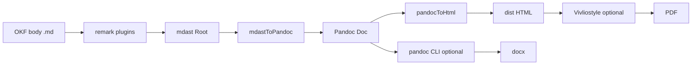

# Markup interchange layer (mdast → Pandoc AST → outputs)

| Field | Value |
|-------|-------|
| **Author** | _(TBD)_ |
| **Date** | 2026-06-21 |
| **Status** | Draft (contract — implement after golden lock) |
| **Profile target** | Body syntax only; OKF frontmatter unchanged (`sorane-okf/0.1`–`0.3`) |
| **Prior art** | bunsen `specs/004-ruby-annotations`, `specs/023-kind-pandoc-filter` |

---

## Overview

sorane today renders Markdown with a single path:

```
remark-parse → remark-gfm → remark-diagram-fences → remark-rehype → rehype-sanitize → HTML
```

Glossary / FAQ structure is extracted partly by **line parsers** (`glossary-page.ts`) and partly by **mdast** (`search/chunker.ts`). Ruby and glossary term autolinks are not supported.

This design introduces a **format-neutral interchange hub** between mdast and final outputs:

```
Markdown (OKF body, non-destructive)
  → mdast (+ sorane extensions)
  → Pandoc JSON Doc (internal AST, not persisted by default)
  → HTML (web; Phase 1)
  → docx / other (Pandoc CLI; Phase 3+, optional)
  → PDF (Vivliostyle on built HTML/CSS; Phase 4+, optional)
```

**OKF principle preserved:** per-page `.md` alternates and `okf/bundle.tar.gz` keep **source notation** (`{漢字|かんじ}`, `[[term:id]]`). Build resolves term links to `href` in HTML only; it does not rewrite body source unless the author runs an explicit migrate command.

**Why Pandoc-shaped AST before Vivliostyle/docx:** one extension node maps once to `Span`/`Link` attributes; HTML, Word, and PDF pipelines consume the same hub. Vivliostyle remains a **sibling output** over `dist/` HTML — not the source of truth.

---

## Goals

| ID | Goal |
|----|------|
| G1 | **Single mdast tree** per page body shared by render, font charset, glossary/FAQ extract, search chunk |
| G2 | **Ruby** (furigana) with bunsen-compatible syntax and `<ruby><rt>` HTML |
| G3 | **Glossary term links** resolving OKF `glossary` / `glossary-term` index at build time |
| G4 | **Deterministic** md → HTML for golden fixtures (byte-stable modulo agreed normalization) |
| G5 | **Accessibility**: semantic `<ruby>`, descriptive term link `title`, no JS-required reading |
| G6 | **Future outputs** without re-parsing: docx via Pandoc CLI; PDF via Vivliostyle on HTML |

## Non-goals (this design)

- Running `pandoc` CLI in default `sorane build` (Phase 1 uses in-process `pandocToHtml` only)
- Wikilink `[[Page Name]]` (bunsen backlog; sorane uses `[[term:…]]` tied to OKF glossary)
- Automatic keyword detection in prose (ambiguous; deferred)
- Inline body rewrite on build for term links in `.md` alternates
- GlyphWiki / KAGE (separate font-layer design)
- Lawtext / 法令 XML (future sibling format)

---

## Pipeline (normative)



### Shared parse entry

```typescript
// packages/core/src/markup/process-markdown.ts (new)

export interface ProcessMarkdownOptions {
  readonly diagrams?: DiagramsConfig;
  readonly glossaryIndex?: GlossaryLinkIndex; // build-time term → href map
}

export function processMarkdownToMdast(
  source: string,
  opts?: ProcessMarkdownOptions,
): MdastRoot;
```

**Consumers (same tree):**

| Consumer | Today | After |
|----------|-------|-------|
| `render.ts` | own `unified()` | `mdastToPandoc` → `pandocToHtml` |
| `glossary-page.ts` | line parser | mdast heading boundaries + subtree plain text |
| `faq-page.ts` | line parser | same pattern as bunsen `faq-extractor.ts` |
| `@sorane/font` charset | `extraText` from HTML | `extractRubyCharset(mdast)` merged |
| `search/chunker.ts` | separate parse | optional: reuse mdast (Phase 2) |

---

## mdast extensions (sorane)

Extensions are **mdast nodes** inserted by remark plugins. Code fences and `inlineCode` are never scanned for ruby/term syntax.

### `ruby` (bunsen 004 compatible)

```typescript
interface RubyAnnotationNode {
  type: 'ruby';
  base: string;       // 親文字
  text: string;       // ふりがな（rt）
  source: 'aozora' | 'markdown';
  position?: Position;
}
```

**Syntax (MUST parse identically to bunsen `specs/004-ruby-annotations/contracts/ruby-parser.md`):**

| Style | Example | Notes |
|-------|---------|-------|
| Aozora | `朝日新聞《あさひしんぶん》` | Base = trailing kanji run or `\|`-delimited span |
| Markdown | `{振り仮名|ふりがな}` | Pipe form |
| Aozora explicit | `夕{\|ゆう}` | `｜` (U+FF5C) before `《》` |

**MUST NOT** parse inside: `code`, `inlineCode`, fenced blocks, `termLink` literals (plugin order: ruby before term links).

### `termLink` (sorane new)

Unresolved in source; **resolved at build** when `glossaryIndex` is provided.

```typescript
interface TermLinkNode {
  type: 'termLink';
  termId: string;           // stable id, e.g. "distribution"
  label?: string;           // optional display override
  position?: Position;
}
```

**Syntax:**

```markdown
[[term:distribution]]
[[term:dcat|DCAT]]
```

| Form | Meaning |
|------|---------|
| `[[term:{id}]]` | Link text = glossary term `title` or glossary `##` heading label |
| `[[term:{id}\|{label}]]` | Link text = `{label}` |

**Resolution (build):**

1. Lookup `termId` in `GlossaryLinkIndex` (built from all `glossary-term` pages + `glossary` `##` anchors / `terms:` YAML).
2. On hit: `termLink` → mdast `link` with `url`, `title` (term definition snippet ≤120 chars), `data.hProperties.className: ['glossary-term-link']`.
3. On miss: leave as mdast `termLink` → HTML `<span class="glossary-term-unresolved" title="…">…</span>` + `validate --json` warning `category: glossary`.

**MUST NOT** auto-detect terms in plain text (explicit `[[term:…]]` only).

### Existing diagram extension

`sorane` already has `remarkDiagramFences` → mdast mutation / rehype pre. In Pandoc mapping:

| mdast | Pandoc (Phase 1) |
|-------|------------------|
| `code` fence `mermaid` / `d2` / … | `CodeBlock` with lang; diagram HTML path unchanged (rehype or pre-rendered `RawBlock`) |

Diagram Pandoc mapping follows `design/diagram-formats.md`; golden fixtures live under `design/golden/diagrams/` when added. Markup golden set covers **ruby + termLink** first.

---

## Pandoc interchange (`data-sorane-*`)

Namespace: **`data-sorane-*`** (bunsen uses `data-bunsen-*`; do not mix in sorane output).

### mdast → Pandoc (`mdastToPandoc`)

API:

```typescript
// packages/core/src/ast/mdast-to-pandoc.ts

export const PANDOC_API_VERSION = [1, 23, 0, 1] as const;

export function mdastToPandoc(tree: MdastRoot): PandocDoc;
```

**Standard nodes:** same 1:1 map as bunsen `specs/023-kind-pandoc-filter/contracts/mdast-to-pandoc.md` (C2 table).

**sorane extensions:**

| mdast | Pandoc Inline / Block |
|-------|------------------------|
| `ruby` | `Span ("", [], [("data-sorane-rt", text)], [Str base])` |
| `termLink` (resolved) | `Link (("", ["glossary-term-link"], [("data-sorane-term", id)]), [Str label], (url, title))` |
| `termLink` (unresolved) | `Span ("", ["glossary-term-unresolved"], [("data-sorane-term", id)], [Str label])` |

Properties:

- **Pure:** no input mutation; deterministic output.
- **Lossy:** drop `position`; unknown mdast types → skip with dev warning (Phase 1).
- **Top-level `Doc`:** `{ 'pandoc-api-version': [1,23,0,1], meta: {}, blocks }` — YAML frontmatter stays outside this function.

### Pandoc → HTML (`pandocToHtml`)

API:

```typescript
// packages/core/src/ast/pandoc-to-html.ts

export function pandocToHtml(doc: PandocDoc, opts?: { sanitize: 'strict' }): string;
```

**Standard nodes:** bunsen `pandoc-to-html.md` R2 table (subset sufficient for sorane sites).

**sorane-specific:**

| Pandoc | HTML |
|--------|------|
| `Span` with `data-sorane-rt` | `<ruby>{base}<rt>{rt}</rt></ruby>` |
| `Link` with class `glossary-term-link` | `<a href="…" class="glossary-term-link" title="…">…</a>` |
| `Span` class `glossary-term-unresolved` | `<span class="glossary-term-unresolved" data-sorane-term="…" title="Unresolved term">…</span>` |

Sanitize: extend `sanitizeSchema` in `render.ts` with `ruby`, `rt`, and `data-sorane-term` on `span`/`a` as needed.

---

## Glossary link index

Built once per `runBuild()` from parsed concepts:

```typescript
interface GlossaryLinkEntry {
  termId: string;           // term_id or {#anchor}
  href: string;             // outRel, e.g. distribution.html
  title: string;            // human label
  description?: string;     // for link title attribute
}

type GlossaryLinkIndex = ReadonlyMap<string, GlossaryLinkEntry>;
```

Sources (precedence: later overrides earlier on duplicate `termId` → validate warning):

1. `type: glossary-term` → `term_id` (required for validate warning if missing)
2. `type: glossary` body `## Label {#id}` anchors
3. `type: glossary` frontmatter `terms[].id`

Duplicate `termId`: last wins in index; `validate --json` warns on collision.

---

## OKF / bundle / search

| Surface | Ruby | Term link |
|---------|------|-----------|
| Source `.md` | `{漢字\|かんじ}` preserved | `[[term:id]]` preserved |
| HTML | `<ruby><rt>` | `<a class="glossary-term-link">` |
| `.md` alternate | unchanged | unchanged |
| `okf/bundle.tar.gz` | unchanged | unchanged |
| `search-index.json` | plain text includes base+rt readings | chunk text includes link label |
| `catalog.jsonld` | — | — |

Charset: `extractRubyCharset(mdast)` merges into `@sorane/font` subset inputs (bunsen `extract-ruby-charset.ts` port).

---

## Validation

| category | When |
|----------|------|
| `glossary` | Unresolved `[[term:…]]`; duplicate `term_id`; term link to missing id |
| `lang` | (existing) mixed script without `lang` markup |

Ruby parse failures (unclosed `《》`) → `category: okf` or new `markup` category (TBD in PR 2); default **warning** in Phase 1.

---

## Golden fixtures (contract tests)

Directory: `design/golden/markup/`

| ID | Input | Assert |
|----|-------|--------|
| `1-ruby` | Aozora + pipe ruby | `1-ruby.html` |
| `2-term-link` | `[[term:…]]` with mock index | `2-term-link.html` |
| `3-combined` | ruby inside paragraph with term link | `3-combined.html` |

Test (after implementation):

```typescript
// tests/markup-golden.test.ts
// pipeline: .md → processMarkdownToMdast → mdastToPandoc → pandocToHtml
// compare normalized HTML to design/golden/markup/*.html
```

Normalization rules for byte compare:

- Single newline between block tags
- No pretty-print whitespace inside tags
- Attribute order: `class`, `href`, `title`, `data-sorane-term` (documented per fixture)

---

## Phased implementation (PR plan)

| PR | Scope | Acceptance |
|----|-------|------------|
| **PR1** | `ast/pandoc-types.ts`, `mdast-to-pandoc`, `pandoc-to-html`; wire `render.ts` for **plain markdown only**; golden `1-article` parity with current HTML | Existing sites: no visual change |
| **PR2** | Port bunsen `parse-ruby.ts` + charset extract; golden `1-ruby` | `<ruby><rt>`; font subset includes rt glyphs |
| **PR3** | `GlossaryLinkIndex` + `parse-term-link.ts`; golden `2-term-link`, `3-combined`; CSS `.glossary-term-link` | `examples/open-data` links terms in prose |
| **PR4** | mdast-first FAQ/glossary extractors (keep line validators for warnings) | Definition bodies with ruby survive extract |
| **PR5** | `sorane export --format docx` (optional Pandoc CLI) | docx roundtrip smoke |
| **PR6** | Vivliostyle doc + `sorane export --format pdf` sketch | PDF from `dist/`; out of default CI |

**Do not start PR2–PR4 until PR1 golden passes.**

---

## Open questions

| ID | Question | Default if silent |
|----|----------|-----------------|
| OQ1 | Unresolved term: `span` vs plain text + footnote? | `span.glossary-term-unresolved` (visible in authoring) |
| OQ2 | Export `[[term:id]]` in docx as hyperlink or footnote? | Hyperlink (Pandoc `Link`) |
| OQ3 | Share `parse-ruby.ts` as `@sorane/markup` package with bunsen? | Copy into sorane first; extract later |
| OQ4 | `markup` vs `glossary` validate category for parse errors? | `glossary` for term; `okf` for ruby syntax |

---

## References

- bunsen: `~/repo/bunsen/specs/004-ruby-annotations/`
- bunsen: `~/repo/bunsen/specs/023-kind-pandoc-filter/`
- bunsen: `~/repo/bunsen/docs/architecture.md` §5.5
- sorane: `design/diagram-formats.md`, `packages/core/src/glossary-term-page.ts`
- sorane: `design/quality-gates.md` (`lang` category)