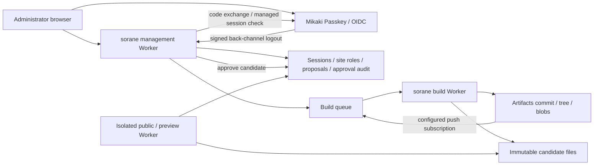

# sorane management Worker

Mikaki authenticates people; sorane stores site membership and publication
approval. It coordinates the [Artifacts build and publication pipeline](../ssg-worker/README.md). This private workspace runs separately from the SSG CLI and has no
GitHub dependency. It includes a browser UI and a cookie-authenticated JSON API.



The unchanged [Mikaki RP adapter](vendor/mikaki/README.md) supplies Authorization
Code + PKCE S256, ES256 `private_key_jwt`, ID Token verification, managed session
leases and signed back-channel logout. The pinned upstream commit and license
are included. No runtime checkout of `../mikaki` is required.

| Role | View site/proposals | Submit proposal | Approve commit | Manage members/audit |
| --- | --- | --- | --- | --- |
| `viewer` | Yes | | | |
| `editor` | Yes | Yes | | |
| `publisher` | Yes | | Yes | |
| `owner` | Yes | Yes | Yes | Yes |

Login creates no membership. Mikaki's operator role does not confer sorane
privileges. The first owner is explicitly bootstrapped by the database operator;
later owners manage members in the UI. Pairwise `sub` values are scoped to the
registered RP, so the database pins issuer, client ID and RP origin. Changing
those requires a new database and an explicit identity migration.

Every mutation requires an exact origin, CSRF protection, a fresh Mikaki managed
session check and a current role. D1 admits the operation, records its audit,
applies its effects and advances the site's revision in one batch. Concurrent
role revocation, stale revisions, conflicting operation IDs and removal of the
last owner are rejected. Read requests may use an unexpired session lease;
mutations stop when Mikaki is unavailable. Logout removes the local session;
back-channel logout prevents an in-flight positive check from restoring it.

## Verify locally

From the sorane repository root:

```sh
npm install
npm run workers:types
npm run workers:check
npm run admin:test
npm run ssg:test
npm run workers:build
```

The build command is a Wrangler dry run. Tests run the actual Workers runtime
D1, Queues and R2 with isolated OIDC and Artifacts RPC fixtures: signed ID Tokens and logout tokens,
single-use authorization codes, PKCE, fresh endpoint-specific assertions, role
checks, races, rollback, revocation, outages and browser forms. They do **not**
exercise a production Mikaki login or deploy Cloudflare resources.

Wrangler currently pins an alpha Miniflare version; the test setup uses its V4
options adapter. `sharp` is overridden within Miniflare to the patched 0.35.5
release. Regenerate Worker types after changing Wrangler configuration.

## Connect a registered Mikaki RP

Use a dedicated admin origin and a separate client/key/database per environment.
Follow Mikaki's [RP integration guide](https://github.com/masanork/mikaki/blob/main/docs/rp-integration.md)
and [managed client runbook](https://github.com/masanork/mikaki/blob/main/docs/rp-client-operations.md).
Mikaki registration accepts canonical HTTPS callbacks on the registered sector
host. Register the exact `https://YOUR-ADMIN-HOST/callback` and the public
P-256 JWK. Register `https://YOUR-ADMIN-HOST/backchannel` separately.
Only the public key goes to Mikaki; store the private JWK in `RP_PRIVATE_JWK`.

1. Set `ISSUER`, `CLIENT_ID` and `RP_ORIGIN` in Wrangler configuration. For local
   development, copy `.dev.vars.example` to `.dev.vars` and supply the actual
   values and private key, plus the isolated `PUBLIC_ORIGIN` and the engine fingerprint printed by `npm run bundle -w @sorane/ssg-worker`. Keep secrets out of tracked files. For HTTPS local
   callbacks, run `npm run admin:dev -- --local-protocol https` and use exactly
   `https://localhost:8787` as the origin, if that callback is registered in your
   development OP. A disposable OP must implement the product's JSON session
   check endpoint; the old form-only fixture is not used here.
2. Apply the local schema:

   ```sh
   npm run migrate:local -w @sorane/admin-worker
   ```

3. Generate the identity pin, review the emitted SQL, then apply it locally.
   Replace the example values with the same registered values as the Worker.

   ```sh
   npm run --silent admin:bootstrap -- --mode instance \
     --issuer https://auth.mikaki.org --client YOUR-CLIENT-ID \
     --origin https://YOUR-ADMIN-HOST > /tmp/sorane-instance.sql
   npx wrangler d1 execute sorane-admin --local \
     --config packages/admin-worker/wrangler.jsonc --file /tmp/sorane-instance.sql
   ```

4. Sign in at the configured origin. The home page displays your RP's `sub`, even
   when you have no site memberships. Generate a first site and owner using that
   exact subject. Namespace/repository identify the intended Artifacts target;
   this step does not create or access that repository.

   ```sh
   npm run --silent admin:bootstrap -- --mode site \
     --issuer https://auth.mikaki.org --client YOUR-CLIENT-ID \
     --origin https://YOUR-ADMIN-HOST --site my-site --title 'My site' \
     --namespace YOUR-ARTIFACTS-NAMESPACE --repository content \
     --owner YOUR-PAIRWISE-SUB > /tmp/sorane-site.sql
   npx wrangler d1 execute sorane-admin --local \
     --config packages/admin-worker/wrangler.jsonc --file /tmp/sorane-site.sql
   ```

   The script emits SQL only. Apply the complete file as one batch. A mismatched
   identity or existing site fails without overwriting owners. Refresh the UI to
   manage members and submit/review a commit.

For a deployed environment, create a separate D1 database, replace the zero UUID,
set the HTTPS admin origin and route, store the private key as a Worker secret,
and apply migrations/identity/site bootstrap to that database. Configure all three Workers using the [deployment runbook](../ssg-worker/README.md#prepare-a-deployed-environment). The checked-in
configuration disables public Worker/preview URLs and uses local D1. Deployment,
RP registration and production end-to-end qualification are not performed by
these scripts. Invocation logs and traces are disabled to keep
callback query strings out of automatic logs. Application error
logs contain an event ID/status only, without URLs, codes, subjects or keys.

## API

The browser opens an article list with search and a title/body editor. **確認・公開**
contains generated previews and the explicit publish action; **設定** contains
owner-only membership management and advanced commit import. Commit IDs,
repository IDs and draft JSON are never required to write an article.

The editor uses a private `CONTENT_SOURCE` service binding to the builder's
read-only `ContentSource` entrypoint. The builder's default HTTP endpoint remains
404. Site membership is checked before any source read. A selected proposal pins
the immutable repository/commit and retained draft; saving preserves changes to
other articles and their original before hashes. Metadata outside title/body is
preserved. Saving creates a reviewed build proposal and does not publish or write
to Git. Unsaved changes prompt before leaving; save failures keep the input.

`GET /api/session` returns the authenticated pairwise subject and CSRF token.
Use the host-only session/browser cookies, `Origin: RP_ORIGIN`,
`Content-Type: application/json` and `X-CSRF-Token` for JSON mutations. OIDC
access tokens are UserInfo credentials and are not accepted as API bearer tokens.

| Endpoint | Purpose |
| --- | --- |
| `GET /api/sites` | List sites where the caller is a member |
| `GET /api/sites/:id` | Site/revision, build status/digest/validation report, active publication, owner-only membership list |
| `GET /api/sites/:id/audit` | Owner-only last 100 operations |
| `POST /api/sites/:id/members` | Owner sets `{sub, role}` |
| `POST /api/sites/:id/members/remove` | Owner removes `{sub}` |
| `POST /api/sites/:id/proposals` | Editor/owner submits `{commit, message}` |
| `POST /api/sites/:id/drafts` | Editor/owner submits a base commit and bounded Markdown replacements |
| `POST /api/sites/:id/editor` | Editor/owner saves `{proposalId, path, title, body, timestamp?}`; empty path creates an article |
| `POST /api/sites/:id/editor/rebuild` | Editor/owner rebuilds `{proposalId}` against the current engine |
| `GET /api/sites/:id/proposals/:proposalId/draft` | Member reads the retained manuscript changes |
| `POST /api/sites/:id/proposals/:proposalId/preview` | Member obtains a short-lived preview URL with `{}` |
| `POST /api/sites/:id/proposals/:proposalId/approve` | Publisher/owner publishes `{commit, candidate}` |
| `POST /session/check` | Force a managed session recheck (JSON `{}`) |

Site mutations also require a fresh UUID `operationId` and the site's integer
`revision`. Exact retries reuse **all** fields including the original revision;
they return the original operation with `replay: true`. A conflicting ID or stale
revision returns 409. A nonmember gets 404; a member with insufficient rights gets
403. After 409, read the current site and review the change before creating a new
operation. An exact retry can report an earlier site's revision; refresh before
starting a subsequent operation. HTML forms use the same checks and store.

Example proposal:

```json
{
  "operationId": "96c3090f-f453-4b65-9437-5dc8b3e8aa42",
  "revision": 1,
  "commit": "aaaaaaaaaaaaaaaaaaaaaaaaaaaaaaaaaaaaaaaa",
  "message": "Update the introduction"
}
```

## Artifacts and autonomous SSG boundary

Submission records a build job in the same audited D1 transaction. A durable
outbox sends its ID to Queues; the scheduled handler recovers missed sends.
The build Worker reads the configured Artifacts commit, checks its Git trees and
blobs, runs the actual sorane validator/engine in a confined Workers filesystem,
and stores content-addressed files and a manifest in R2. The management UI shows
validation findings and offers a preview on an origin separate from the admin.
Preview URLs expire within 60 seconds and remain bound to a live session and
membership. They are temporary bearer capabilities; treat the URL as private.
Browser preview forms show a short-lived link on the management origin before
opening the isolated preview, preserving the restricted form-action policy.

Approval requires the exact commit, candidate SHA-256 and configured engine
fingerprint. It atomically writes the approval audit and switches the public
pointer to those existing files, without rebuilding. Responses report
`deployed: true` while that approval is the current public pointer; an older
idempotent retry reports false after a newer publication replaces it. Legacy
approval rows without a build receipt never become public pointers. Build
completion alone does not publish.

The builder neither runs repository scripts nor issues Git tokens. It has no
Mikaki RP private key or browser session cookies. It builds after an authenticated
proposal or an operator-configured Artifacts push. Push-created proposals show
their service provenance and require the same human publication approval.
Generated Markdown can be submitted as a retained manuscript draft under a human
Mikaki session, using the [draft API](#manuscript-drafts). Independent agent
execution, repository writes and workload authentication are not connected yet. An agent needs its
own workload identity and scoped delegation. Mikaki's `mikaki-managed-work-v1`
proposal/adoption gate is a separate, locally qualified implementation; use its
explicit human approval path when connecting repository writes, rather than
turning a UserInfo token or a historical publication approval into write rights.

For supported features, limits and provisioning, see the
[build Worker runbook](../ssg-worker/README.md).

## Manuscript drafts

A draft overlays Markdown changes on an immutable Artifacts commit. It does not
commit or push to Git. It is useful for reviewing externally generated text before
granting an agent repository access. Sorane stores proposal data; Mikaki continues
to authenticate the submitting person. No local workload issuer or grant registry
is introduced.

Submit `POST /api/sites/:id/drafts` with the existing cookie, Origin and CSRF
requirements. Editors/owners can submit; publishers/owners separately approve the
exact ready candidate through the existing approval endpoint.

```json
{
  "operationId": "96c3090f-f453-4b65-9437-5dc8b3e8aa42",
  "revision": 4,
  "commit": "622a49700ce01c9bbd6c7259fa99f3dde2c2c524",
  "message": "Review a generated article",
  "repositoryId": "ryy6r2arl7mrslik",
  "changes": [{
    "path": "content/new.md",
    "before": null,
    "text": "---\ntype: article\ntitle: Draft\ntimestamp: 2026-10-10T00:00:00Z\nprofile: sorane-okf/0.1\n---\n\nDraft manuscript.\n"
  }]
}
```

Each replacement/deletion requires `before`, the SHA-256 of the exact base file
bytes. `before: null` creates a file only if it is absent; `text: null` deletes an
existing file. Paths must be safe `.md` paths beneath the **base configuration's**
content directory. Configuration, scripts and static assets cannot be changed.
The builder checks the live Artifacts repository ID, base Git object integrity
and every before hash, then runs the ordinary validator and confined SSG.

JSON requests are capped at 192 KiB, with 1–16 distinct changes, 64 KiB of UTF-8
text per file and 128 KiB of total replacement text. Duplicate paths, extra fields,
invalid hashes, NUL and invalid Unicode are rejected. The JSON `changes` field
must be an array. Legacy URL-encoded callers can send that array as JSON text;
its complete encoded form request retains the existing 8 KiB limit.

Prepare a request from selected locally edited files without committing or sending:

```sh
npm run --silent admin:draft -- \
  --cwd /path/to/content-repository --base BASE-SHA1 \
  --repository-id ARTIFACTS-REPOSITORY-ID --revision CURRENT-SITE-REVISION \
  --message 'Review generated manuscript' \
  --path content/article.md --path content/new.md --out /tmp/manuscript-draft.json
```

The command reads the exact base blobs and selected current files, computes before
hashes, includes additions/deletions, and refuses symlinks. It performs no network,
inference, commit, push or authentication. Output files are created mode 0600
without overwriting an existing file. Submit its full payload to the JSON draft
API; the browser editor prepares this data internally from the selected article.

Admission retains the canonical draft/digest, proposal, audit and durable build
job in one D1 transaction. Exact retries keep the same operation/revision/base/data;
change ordering is canonicalized. Draft data cannot be updated or deleted by the
application. The compact audit binds its digest and submitting human subject.
Site details expose the digest and a member-only review link, rather than returning
all draft bodies in the 100-proposal list. Review pages escape original text.

The immutable candidate manifest additionally records `draft: {schema: 1, digest}`.
`commit` and `tree` identify the **base Git source**, not a new Git commit containing
the changes. Missing/corrupt retained draft data fails the build; it cannot silently
fall back to an unmodified base build. Existing commit-only manifests remain valid.
Preview expiry/session checks and human publication approval are unchanged.

Publishing a draft serves its retained R2 files; a future build from the Git branch
will not include those changes until a separately authorized Git adoption occurs.
Copying the browser cookie or a UserInfo token to an agent is not a supported
delegation method. Productive workload access remains pending Mikaki's verified
issuer/launcher, current grant/run checks and exact adoption contract.
