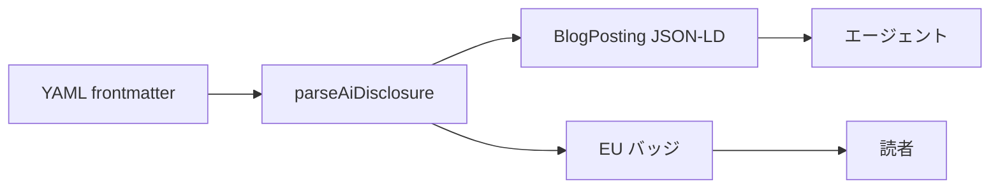
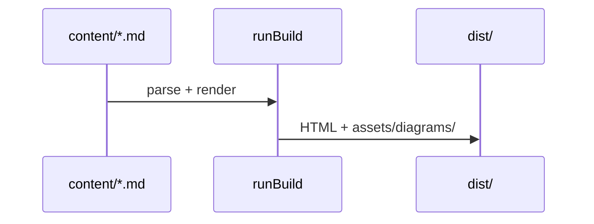
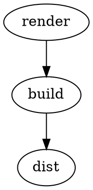

sorane は Markdown のコードフェンスで書いた図を HTML で表示します。ソースは `.md` 代替ファイルと OKF バンドルにそのまま残ります（bunsen Strategy A）。

## Mermaid（クライアント）

` ```mermaid ` フェンスを使います。`alt` は info string または `%% alt:` コメントで指定できます。



## シーケンス図



## Mermaid（ビルド時）

`mermaid.mode: build` にすると `@mermaid-js/mermaid-cli`（mmdc）で SVG を生成します。クライアント loader は不要です。

[ssg.sorane.dev](https://ssg.sorane.dev/) は Pages ビルドを軽く保つため **client モード**を使っています（このページの Mermaid はクライアント描画）。CI で Chromium を入れられるサイトは build モードも選べます。詳細は [デプロイ](deployment.html#図表d2--mermaid) を参照してください。

```yaml
build:
  diagrams:
    mermaid:
      mode: build
      mmdc: mmdc
```

## Graphviz（ビルド時）

`build.diagrams.graphviz.enabled: true` と Graphviz `dot` CLI が必要です。



## D2（ビルド時）

` ```d2 ` フェンスはビルド時に SVG へコンパイルします（`build.diagrams.d2.enabled: true` と `d2` CLI が必要）。

```d2 alt="シンプルなトポロジ"
sorane: {
  shape: rectangle
}
build: {
  shape: rectangle
}
sorane -> build: render
```

## 設定

`build.diagrams` で有効化・モードを切り替えます。詳細は [設定](configuration.html) を参照してください。