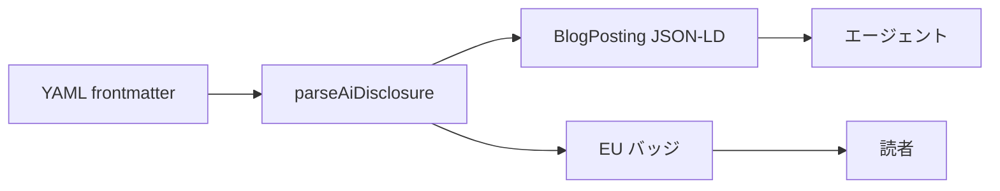
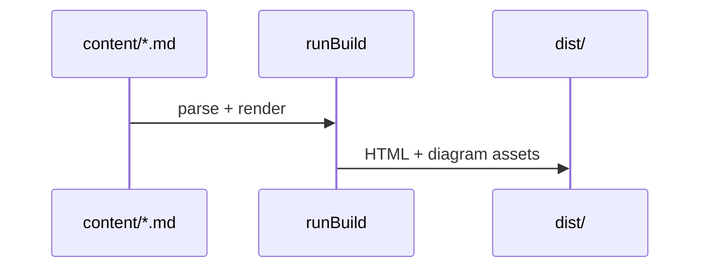

空音では Mermaid のコードフェンスで図を記述します。ソースは Markdown と OKF バンドルに残り、HTML 表示では Mermaid が図として描画します。

図には `alt` を指定してください。フェンスの info string に書く方法と、本文に `%% alt:` コメントを加える方法があります。


```mermaid alt="AI 開示のデータフロー"
flowchart LR
  FM[YAML frontmatter] --> PARSE[parseAiDisclosure]
  PARSE --> JSONLD[BlogPosting JSON-LD]
  PARSE --> HTML[EU バッジ]
  JSONLD --> AGENTS[エージェント]
  HTML --> HUMAN[読者]
```


```mermaid
%% alt: ビルドパイプライン
sequenceDiagram
  participant MD as content/*.md
  participant BUILD as runBuild
  participant DIST as dist/
  MD->>BUILD: parse + render
  BUILD->>DIST: HTML + diagram assets
```

## 表示モード

既定の `client` モードはブラウザーで描画します。Mermaid のアセットはページ内に図がある場合だけ出力されます。

```yaml
build:
  diagrams:
    enabled: true
    mermaid:
      mode: client
```

`mode: build` を選ぶと `@mermaid-js/mermaid-cli`（`mmdc`）でビルド時に SVG を生成します。CI では Chromium が必要です。

```yaml
build:
  diagrams:
    enabled: true
    mermaid:
      mode: build
```

詳しくは[設定](configuration.html)と[デプロイ](deployment.html)を参照してください。
